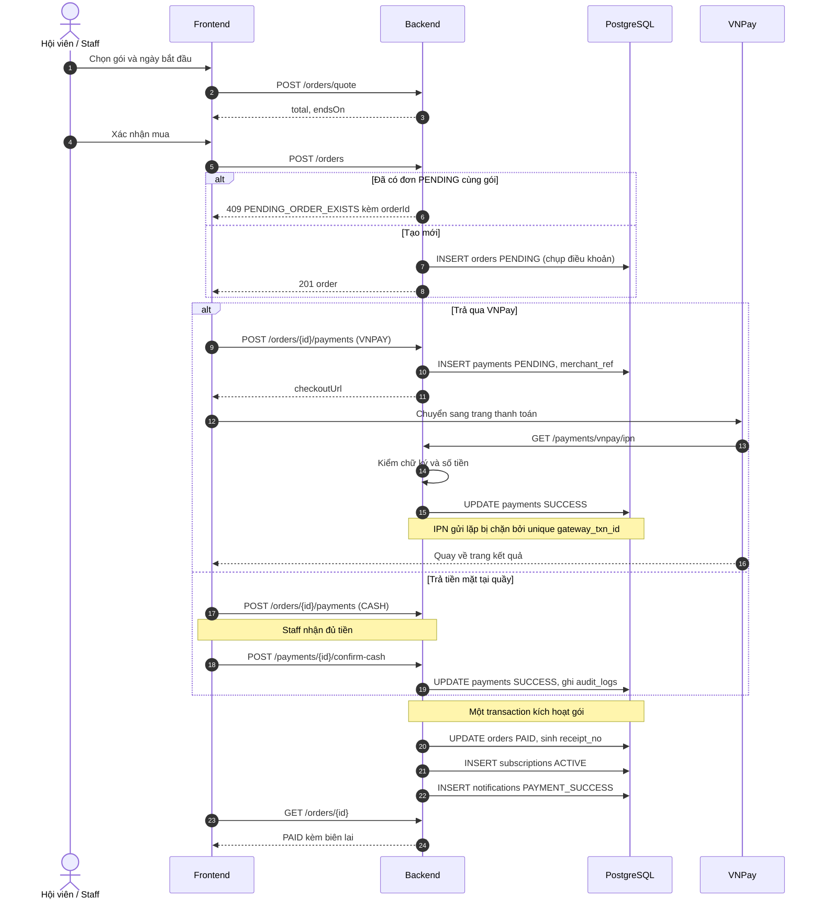
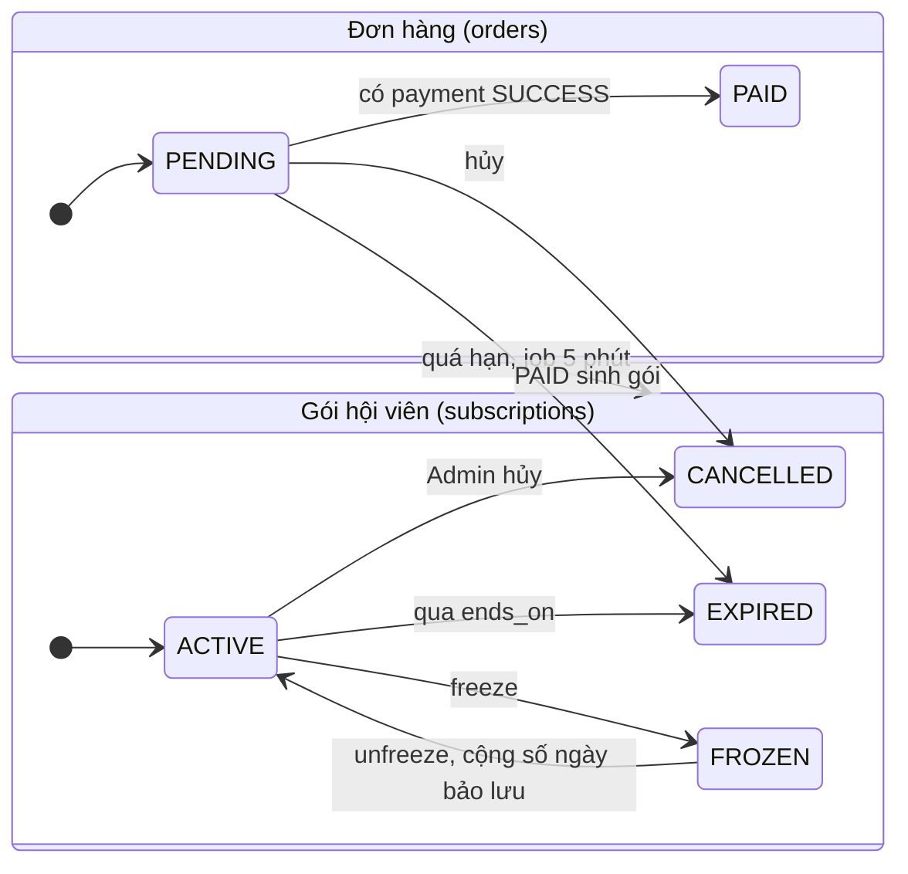
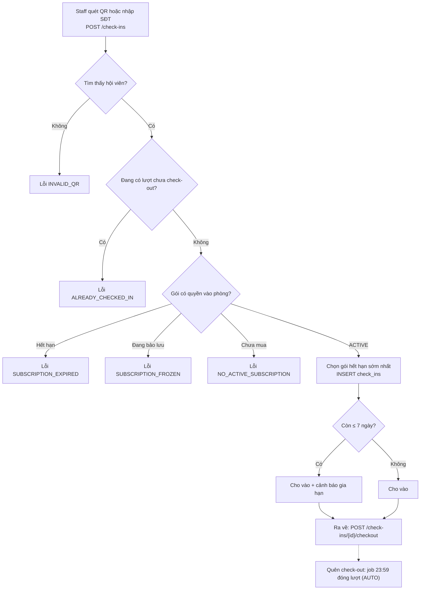
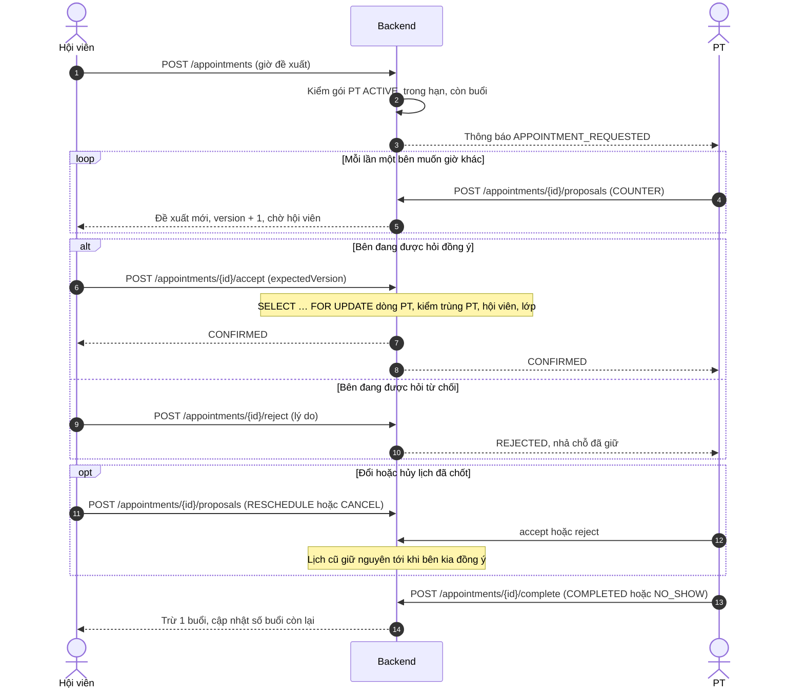
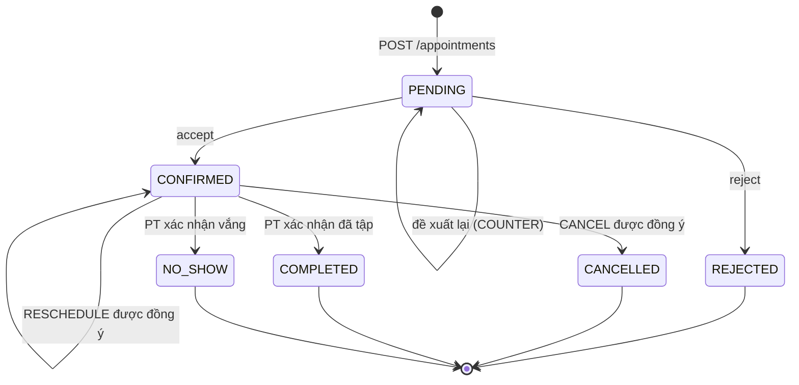
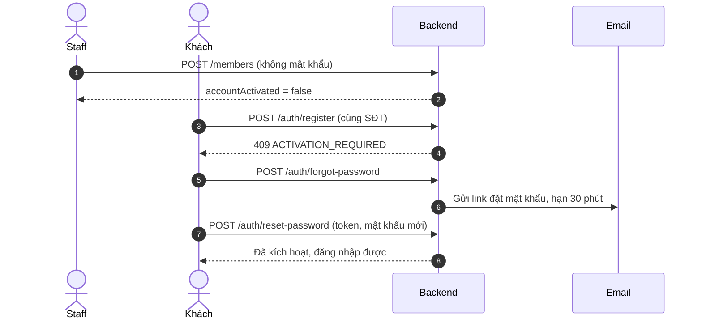
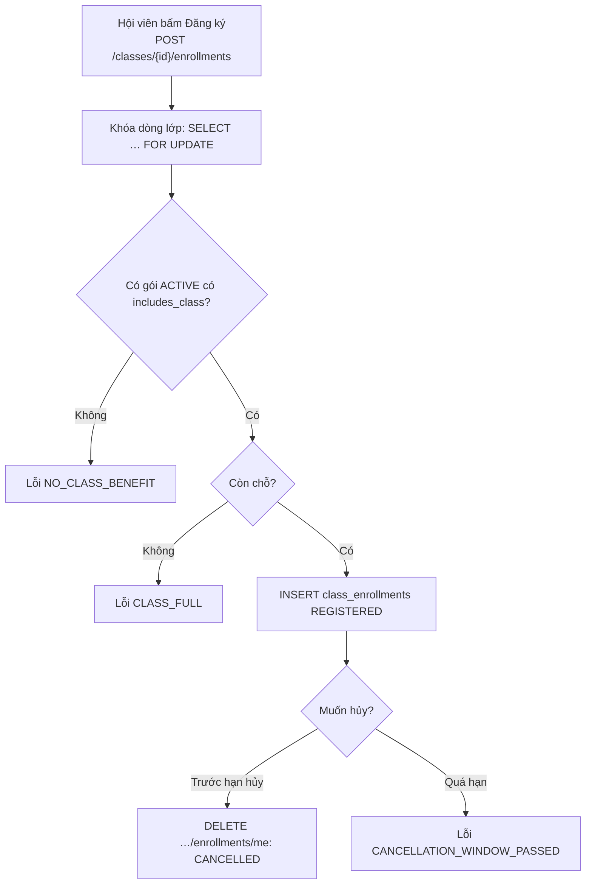

# Tiến hành công việc: Hệ thống quản lý phòng gym

Oct 5, 2026 · @KTPMUD

Nhóm đã chốt **bản chuẩn v3** ngày 05/10: 44 use case, 18 bảng, 74 API, độ phủ 100%. Tab này giữ kết quả rà soát bản v2 (mục 1–3), việc chuẩn bị trước khi code (mục 4), kế hoạch (mục 5–8), các quyết định đã chốt (mục 10–11), luồng công việc kèm code vẽ sơ đồ (mục 12) và công nghệ (mục 13).

Bản chuẩn đã chốt (use case, ERD, API và ma trận truy vết): Đề xuất v3

## 1. Kết quả rà soát bản v2 (đã xử lý ở v3)

Tổng 109 yêu cầu chức năng: ERD đạt 106/109 (97%), API đạt 104,5/109 (96%). Cách chấm: đủ = 1 điểm, một phần = 0,5, thiếu = 0. Danh sách yêu cầu gộp cả bản US cũ và bản mới trong Tài liệu 2 (bỏ các story trùng nghĩa), cộng các chức năng chỉ có trong sơ đồ use case (đăng ký lớp của hội viên, mã giảm giá, actor Email/SMS).

| Nhóm use case                                     | Số yêu cầu | ERD     | API     | Thiếu hoặc một phần                                          |
| ------------------------------------------------- | ---------- | ------- | ------- | ------------------------------------------------------------ |
| Tài khoản & hồ sơ (M01–M07)                       | 7          | 100%    | 100%    | —                                                            |
| Xem, so sánh, lọc gói (M08–M11)                   | 4          | 100%    | 100%    | Tham số lọc giá/thời hạn mới ghi "đề xuất"                   |
| Mua, gia hạn, theo dõi gói (M12–M18, cả hai bản)  | 10         | 90%     | 90%     | Nâng cấp gói (M17 cũ)                                        |
| Thanh toán (M19–M23)                              | 5          | 90%     | 90%     | M22: hóa đơn điện tử → biên lai nội bộ                       |
| Check-in/out của hội viên (M24–M27)               | 4          | 100%    | 88%     | M27: cảnh báo chỉ hiện ở quầy, hội viên không nhận thông báo |
| Đặt và thương lượng lịch PT (M28–M38 + nhắc lịch) | 12         | 100%    | 100%    | —                                                            |
| Lịch làm việc của PT (T01–T10 mới)                | 10         | 100%    | 95%     | T02: PT không lọc được lớp mình dạy                          |
| PT quản lý hội viên (T06–T10 cũ)                  | 5          | 100%    | 100%    | —                                                            |
| Staff: hội viên, gia hạn, check-in (S01–S09)      | 9          | 100%    | 100%    | —                                                            |
| Admin: tài khoản, phân quyền (A01–A05)            | 5          | 100%    | 100%    | —                                                            |
| Admin: gói tập (A06–A10)                          | 5          | 100%    | 100%    | —                                                            |
| Admin: nhân viên, PT (A11–A16)                    | 6          | 100%    | 100%    | —                                                            |
| Lớp học: Admin (A17–A21) + hội viên (sơ đồ)       | 8          | 100%    | 100%    | —                                                            |
| Giao dịch & doanh thu (A22–A27)                   | 6          | 100%    | 92%     | A22: GET /payments thiếu lọc theo ngày, phương thức          |
| Thống kê (A28–A32)                                | 5          | 100%    | 100%    | —                                                            |
| Thông báo (N01–N06)                               | 6          | 100%    | 100%    | —                                                            |
| Mở rộng trong sơ đồ (mã giảm giá, Email/SMS)      | 2          | 25%     | 25%     | Giảm giá đã loại khỏi phạm vi; thông báo chỉ trong ứng dụng  |
| **Tổng**                                          | **109**    | **97%** | **96%** |                                                              |

Độ khớp mã truy vết thấp hơn nhiều: ERD và API dẫn 17 mã không có trong Tài liệu 2 (M39–M43, T11–T15, S10–S16). Ngược lại, ERD/API có nhiều chức năng chưa được viết thành story: bảo lưu gói, check-in bằng SĐT, check-out cưỡng bức, Staff đề xuất lịch hộ, nhật ký kiểm toán, chống xử lý lặp. Giảng viên chấm theo use case sẽ thấy độ lệch này đầu tiên.

## 2. Chỗ thiếu hoặc lệch của v2 và cách đã xử lý

Cả 15 điểm đã được xử lý trong bản chuẩn v3 hoặc bằng quyết định ở mục 10. Bảng giữ lại để giải thích lý do thay đổi khi báo cáo với giảng viên.

| #   | Vấn đề                                                                                                                                     | Ảnh hưởng                                                                       | Đề xuất sửa                                                                                                               | Ưu tiên |
| --- | ------------------------------------------------------------------------------------------------------------------------------------------ | ------------------------------------------------------------------------------- | ------------------------------------------------------------------------------------------------------------------------- | ------- |
| 1   | Chưa chọn kênh gửi Email/SMS; THONG_BAO không có cột kênh, không có nhật ký gửi                                                            | Quên mật khẩu và kích hoạt tài khoản tạo tại quầy không chạy được               | Chốt gửi link qua email (SMTP; dev dùng Mailtrap/MailHog). Thêm cột kenh (IN_APP/EMAIL) hoặc bảng nhật ký gửi             | P0      |
| 2   | NO_SHOW chưa chốt: buổi vắng có trừ buổi không                                                                                             | Đổi trạng thái LICH_TAP_PT và cách tính số buổi còn lại                         | Thêm trạng thái NO_SHOW, PT đánh dấu sau giờ tập, trừ 1 buổi (đề xuất)                                                    | P1      |
| 3   | Không có nơi lưu tham số cấu hình: hạn thanh toán đơn, số ngày báo sắp hết hạn, giờ nhắc lịch, ngưỡng khóa đăng nhập, hạn hủy lớp mặc định | BE mỗi người hard-code một giá trị                                              | Bảng SYSTEM_SETTING (key, value) hoặc file config + bảng giá trị mặc định trong tài liệu                                  | P1      |
| 4   | PT không xem được lớp mình dạy: GET /classes thiếu lọc trainerId; GET /class-enrollments chỉ cho MEMBER và ADMIN                           | US-T02 (lịch trong ngày) thiếu phần lớp; PT không biết ai đăng ký               | Thêm query trainerId; mở quyền TRAINER (lớp của mình) và STAFF                                                            | P1      |
| 5   | GET /payments chỉ lọc memberId, status                                                                                                     | Admin không xem được giao dịch theo ngày (US-A22)                               | Thêm from, to, method, orderId                                                                                            | P1      |
| 6   | Biên lai (M22) chỉ trả tổng tiền                                                                                                           | Không in được biên lai đầy đủ                                                   | Thêm so_bien_lai vào BIEN_LAI; response kèm tên gói, hội viên, phương thức, người thu. Sửa chữ US thành "biên lai nội bộ" | P1      |
| 7   | Bảng DB tên tiếng Việt không dấu, API camelCase tiếng Anh                                                                                  | Dễ map nhầm khi code entity/DTO                                                 | Chốt một trong hai: đặt tên DB tiếng Anh ngay từ đầu, hoặc có bảng ánh xạ cột ↔ trường                                    | P1      |
| 8   | Nâng cấp gói (M17 cũ) không có bảng/API                                                                                                    | Use case có nhưng hệ thống không làm                                            | Bỏ khỏi phạm vi, hoặc làm đơn giản: mua gói mới, gói cũ CANCELLED, trừ giá trị còn lại theo ngày                          | P2      |
| 9   | Khung giờ rảnh PT lưu theo mốc ngày giờ cụ thể; use case mô tả theo thứ (Thứ 2 17:00–21:00)                                                | PT phải nhập lại mỗi tuần; chưa rõ lịch đã xác nhận nằm ngoài khung mới thì sao | FE có mẫu theo tuần rồi sinh khoảng khi gọi PUT; quy định đổi khung không ảnh hưởng lịch đã xác nhận                      | P2      |
| 10  | Lớp học chỉ là một buổi đơn, không lặp tuần, không có phòng                                                                                | Admin tạo từng buổi                                                             | Chấp nhận cho đồ án, hoặc thêm tùy chọn lặp N tuần khi tạo                                                                | P2      |
| 11  | M27: hội viên không nhận thông báo khi check-in bị từ chối vì hết hạn                                                                      | Lệch câu chữ US                                                                 | Sửa US thành "nhân viên thông báo tại quầy", hoặc tạo thông báo SUBSCRIPTION_EXPIRED                                      | P2      |
| 12  | AUDIT_LOG có ghi nhưng không có API đọc                                                                                                    | Admin không tra được ai khóa tài khoản, ai thu tiền                             | Thêm GET /audit-logs (ADMIN)                                                                                              | P2      |
| 13  | Mã giảm giá vẫn nằm trong sơ đồ <\<extend>>                                                                                                | Sơ đồ nói có, hệ thống không làm                                                | Xóa khỏi sơ đồ                                                                                                            | P3      |
| 14  | Không sửa được nội dung kế hoạch tập (chỉ cập nhật %)                                                                                      | PT phải tạo kế hoạch mới                                                        | Thêm PATCH /training-plans/{id}                                                                                           | P3      |
| 15  | GOI_TAP không có mô tả, ảnh; Staff không đăng ký lớp hộ được                                                                               | Trang chi tiết gói sơ sài; quầy không hỗ trợ được                               | Thêm mo_ta; mở quyền STAFF cho POST enrollments                                                                           | P3      |

## 3. Mâu thuẫn trong tài liệu use case (đã giải quyết)

Bảng 44 use case ở tab Bản chuẩn v3 thay cho toàn bộ danh sách story cũ, nên các mâu thuẫn dưới đây không còn. Huy Trường dùng bảng đó làm Tài liệu 2 v3 và vẽ lại sơ đồ use case theo 44 use case.

- **Mã trùng nghĩa:** M12–M18, M28–M35 và T03–T10 mỗi mã có hai nghĩa. Ví dụ M17 vừa là "nâng cấp gói" vừa là "xem phân bổ buổi theo tháng"; T06–T10 cũ (quản lý hội viên) bị bản mới đè mất.
- **Story chưa viết:** ERD/API dẫn M39–M43 (lớp học, số buổi), T11–T15 (quản lý hội viên của PT), S10–S16 (check-in SĐT, check-out cưỡng bức, bảo lưu, đề xuất hộ) nhưng Tài liệu 2 không có.
- **Sơ đồ Member** có "Xem/Đăng ký/Hủy đăng ký lớp học" nhưng danh sách story Member không có.
- **Sơ đồ Trainer** vẫn là mô hình cũ (xác nhận/từ chối), chưa có "đề xuất lại", "xác nhận hoàn thành buổi".
- **include/extend sai chiều:** "Hủy lịch PT" extend "Đặt lịch PT" không đúng ngữ nghĩa UML (hủy là use case độc lập trên lịch đã có). "Đăng ký lớp" nên có include "Kiểm tra quyền lợi gói".
- **Quyền xác nhận tiền mặt:** US-A24 ghi Admin; ERD/API cho cả Staff. Sửa US.
- **Khách hàng vs Hội viên:** phần II đã định nghĩa rõ, nhưng các story cũ vẫn dùng lẫn. Thống nhất: khách hàng = tài khoản MEMBER chưa có gói ACTIVE.

Mỗi story trong bản v3 nên có thêm 2–4 tiêu chí chấp nhận (Given/When/Then) và cột truy vết sang bảng và endpoint. Đó cũng là đầu vào trực tiếp cho test case.

## 4. Cần bổ sung ngoài ERD và API trước khi code

18 hạng mục, phần lớn xong trong tuần 1 (đến 11/10). Quan trọng nhất là OpenAPI + mock server: có nó thì FE làm song song ngay mà không chờ BE. Viết tắt: BE-L (BE Lead), BE-S (BE Sub), FE-L (FE Lead), FE-S (FE Sub), PM (giám sát, kiểm thử, báo cáo).

| #   | Hạng mục                           | Nội dung tối thiểu                                                                                                                                                                                                                            | Người làm                 | Xong trước                           |
| --- | ---------------------------------- | --------------------------------------------------------------------------------------------------------------------------------------------------------------------------------------------------------------------------------------------- | ------------------------- | ------------------------------------ |
| 1   | Quyết định công nghệ (ADR 1 trang) | ERD dùng exclusion constraint, advisory lock, unaccent, pg_trgm, text\[\], jsonb → bắt buộc PostgreSQL 15+. Chọn BE (NestJS hoặc Spring Boot), FE (React + TypeScript), UI kit, thư viện lịch (FullCalendar), quét QR (html5-qrcode), biểu đồ | Cả nhóm                   | 08/10                                |
| 2   | Quy ước code & Git                 | Cấu trúc thư mục, đặt tên, nhánh main/develop/feature/\*, commit convention, PR cần 1 review, Definition of Done                                                                                                                              | BE-L, FE-L                | 08/10                                |
| 3   | Bảng quản lý công việc             | GitHub Projects/Jira/Trello, mỗi story một thẻ, gắn người và tuần                                                                                                                                                                             | PM                        | 08/10                                |
| 4   | Tài liệu 2 v3 + tiêu chí chấp nhận | Mã US duy nhất, Given/When/Then, cột truy vết US → bảng → endpoint                                                                                                                                                                            | PM                        | 11/10 (nhóm demo), 25/10 (còn lại)   |
| 5   | Bảng thuật ngữ                     | Khách hàng, hội viên, gói, gói hội viên, buổi, đề xuất, bảo lưu…                                                                                                                                                                              | PM                        | 11/10                                |
| 6   | Ma trận phân quyền                 | Vai trò × endpoint × điều kiện sở hữu (của mình, PT phụ trách, tất cả)                                                                                                                                                                        | PM, BE-L                  | 11/10                                |
| 7   | Sơ đồ trạng thái                   | Đơn hàng, Thanh toán, Gói hội viên, Lịch PT, Đề xuất lịch, Đăng ký lớp, Lượt check-in (code Mermaid mẫu ở mục 12): trạng thái, sự kiện chuyển, ai được làm                                                                                    | BE-L                      | 11/10                                |
| 8   | OpenAPI 3 (YAML) + mock server     | Theo 74 API của bản chuẩn v3: schema request/response, validation (độ dài, regex SĐT, enum), mã lỗi; mock bằng Prism hoặc MSW                                                                                                                 | BE-L viết, FE-L dựng mock | 11/10 (nhóm A–D, H), 25/10 (còn lại) |
| 9   | Danh mục mã lỗi + tham số cấu hình | Một bảng duy nhất: code, HTTP, thông điệp tiếng Việt FE hiển thị; giá trị mặc định các tham số                                                                                                                                                | BE-S                      | 11/10                                |
| 10  | Wireframe + sitemap + user flow    | Theo 4 vai trò; design token (màu, chữ, khoảng cách)                                                                                                                                                                                          | FE-S, FE-L duyệt          | 11/10 (màn demo), 25/10 (còn lại)    |
| 11  | Môi trường dev                     | docker-compose (Postgres, BE, FE, MailHog), .env.example, nơi lưu ảnh                                                                                                                                                                         | BE-S                      | 11/10                                |
| 12  | DDL/migration + seed data          | 18 bảng theo ERD v3; seed 4 vai trò, 5 gói, 3 PT, 30 hội viên, lịch sử giao dịch mẫu                                                                                                                                                          | BE-S                      | 18/10                                |
| 13  | Sơ đồ tuần tự cho luồng khó        | Thanh toán + IPN, thương lượng lịch, check-in                                                                                                                                                                                                 | BE-L, BE-S                | 18/10                                |
| 14  | Đặc tả job nền                     | Tự đóng check-in 23:59; báo gói sắp hết hạn 08:00 hằng ngày; nhắc lịch PT; hết hạn đơn PENDING mỗi 5 phút; nhắc PT quá 24 giờ                                                                                                                 | BE-L                      | 18/10                                |
| 15  | Yêu cầu phi chức năng              | bcrypt/argon2, access token 15 phút, refresh 7 ngày, CORS, rate limit, chống truy cập chéo (IDOR), log có requestId, backup DB                                                                                                                | BE-L                      | 18/10                                |
| 16  | Test plan                          | Chiến lược, công cụ (Postman/Newman, Jest hoặc JUnit, Playwright), mẫu test case và bug, kịch bản tương tranh (đặt trùng lịch, lớp đầy, IPN lặp, bấm tạo đơn hai lần)                                                                         | PM                        | 18/10                                |
| 17  | CI + staging                       | Lint, test, build trên GitHub Actions; staging có URL công khai cho IPN; tài khoản sandbox VNPay/MoMo                                                                                                                                         | BE-S                      | 25/10                                |
| 18  | Nội dung thông báo                 | Mẫu cho 12 loại thông báo + email đặt lại mật khẩu                                                                                                                                                                                            | PM                        | 25/10                                |

## 5. Phân vai 5 người

Chia theo hai cặp dọc: cặp Lead làm luồng hội viên (khó nhất: mua gói, thanh toán, thương lượng lịch PT), cặp Sub làm luồng vận hành (quầy, quản trị, báo cáo). Mỗi cặp BE–FE cùng một module trong cùng một tuần nên ít phải chờ nhau.

Người đảm nhận: Triển (BE Lead), Hồng Anh (BE Sub), Sơn (FE Lead), Bằng (FE Sub), Huy Trường (PM). Việc từng tuần của từng người: Phân công chi tiết

| Người                   | Trách nhiệm chung                                                                      | Module sở hữu                                                                                                                                      |
| ----------------------- | -------------------------------------------------------------------------------------- | -------------------------------------------------------------------------------------------------------------------------------------------------- |
| BE Lead                 | Kiến trúc BE, OpenAPI, review mọi PR backend, xử lý giao dịch và khóa                  | Auth & phiên (A), Đơn hàng & thanh toán + IPN (C), Lịch PT (E), Lớp học (I), Báo cáo (J)                                                           |
| BE Sub                  | DB, migration, seed, Docker, CI, staging                                               | Gói (B, H), Quản trị tài khoản (H), Hội viên tại quầy & bảo lưu (F), Check-in (D), PT & khung giờ, theo dõi tập luyện (G), Thông báo & job nền (K) |
| FE Lead                 | Kiến trúc FE, routing theo vai trò, API client + refresh token, review mọi PR frontend | Màn đăng nhập/hồ sơ, cổng hội viên (mua gói, thanh toán, gói của tôi), thương lượng lịch, lịch PT, lớp học phía hội viên                           |
| FE Sub                  | Wireframe, bộ component dùng chung                                                     | Màn quầy (hội viên, check-in, QR), quản trị (gói, tài khoản, lớp), trang PT quản lý hội viên, thông báo, dashboard báo cáo                         |
| Giám sát & báo cáo (PM) | Quản lý tiến độ, chủ trì họp, phân tích nghiệp vụ (BA), kiểm thử (QA), viết báo cáo    | Tài liệu 2 v3, tiêu chí chấp nhận, test case, bộ Postman, E2E, biên bản tuần, slide và kịch bản demo                                               |

PM nên kiểm thử thật chứ không chỉ viết báo cáo: mỗi API xong là có người chạy test ngay, và báo cáo có số liệu kiểm thử thật.

## 6. Kế hoạch 10 tuần

Bắt đầu 05/10, demo lần 1 cuối tuần 4 (30–31/10), đóng chức năng 30/11, nộp cuối cùng 13/12. FE luôn làm trước trên mock server, BE xong thì chuyển sang API thật trong cùng tuần.

| Tuần            | Mục tiêu                                  | Kết quả cuối tuần (để kiểm tra)                                                                                                                                 |
| --------------- | ----------------------------------------- | --------------------------------------------------------------------------------------------------------------------------------------------------------------- |
| 1 (05–11/10)    | Chốt thiết kế, dựng khung                 | Tài liệu 2 v3 (44 use case); openapi.yaml cho xác thực, gói, đơn, thanh toán, check-in, hội viên, tài khoản; migration 10 bảng đầu; FE đăng nhập được trên mock |
| 2 (12–18/10)    | Xác thực, gói, tài khoản                  | Đăng nhập 4 vai trò trên API thật (token_version); Admin quản lý gói và tài khoản Staff/PT; đủ 18 bảng + seed; openapi đủ 74 API                                |
| 3 (19–25/10)    | Mua gói tiền mặt, check-in                | Tạo hội viên → mua gói → tiền mặt → gói ACTIVE → check-in/out chạy trọn trên API thật                                                                           |
| 4 (26/10–01/11) | **Demo lần 1**                            | VNPay sandbox, staging, CI; demo 7 bước ở mục 7                                                                                                                 |
| 5 (02–08/11)    | Lịch PT phần lõi                          | Đề xuất, đề xuất lại, đồng ý, từ chối; không đặt trùng được (k6 xác nhận); khung giờ PT                                                                         |
| 6 (09–15/11)    | Lịch PT hoàn chỉnh, theo dõi tập, bảo lưu | Đổi/hủy lịch bằng đề xuất RESCHEDULE/CANCEL; hoàn thành/vắng trừ buổi; ghi chú, kế hoạch tập; bảo lưu gói                                                       |
| 7 (16–22/11)    | Lớp học, thông báo, email                 | Lớp + đăng ký không vượt sức chứa; 4 job thông báo; quên mật khẩu, kích hoạt tài khoản tại quầy; hồi quy giữa kỳ                                                |
| 8 (23–29/11)    | Báo cáo, bảo mật                          | 4 API báo cáo + dashboard; test truy cập chéo đạt; Playwright 5 luồng                                                                                           |
| 9 (30/11–06/12) | Đóng chức năng 30/11, ổn định             | Bản RC 03/12; 0 bug mức cao; UAT; báo cáo kiểm thử                                                                                                              |
| 10 (07–13/12)   | Nộp và bảo vệ                             | Đóng băng staging 09/12; báo cáo, slide, video; tổng duyệt 09/12 và 11/12                                                                                       |

Việc chi tiết của từng người nằm ở tab Phân công chi tiết. Mỗi tuần giữ 20% thời gian cho sửa lỗi và việc phát sinh. Nếu tuần 5–6 trễ, cắt theo thứ tự: MoMo → xuất XLSX → broadcast → upload ảnh đại diện.

## 7. Demo lần 1 (cuối tuần 4)

Demo một luồng nghiệp vụ khép kín chạy trên API thật: Admin tạo gói → khách mua gói → thanh toán → thành hội viên → check-in. Luồng này phủ khoảng 40 story và các use case UC01–UC20, UC31–UC35 của bản chuẩn v3. Lịch PT chưa đưa vào vì đây là phần khó nhất, làm gấp sẽ lỗi.

Kịch bản khoảng 10 phút:

1. Admin đăng nhập, tạo gói "PT 12 buổi / 3 tháng" kèm quyền lợi, tạo tài khoản Staff và PT.
2. Khách tự đăng ký, xem danh sách gói, lọc theo giá, so sánh hai gói.
3. Khách mua gói, thanh toán VNPay sandbox (nếu chưa kịp thì chọn tiền mặt để Staff xác nhận), nhận thông báo và biên lai.
4. Hội viên xem "Gói của tôi": ngày bắt đầu, ngày kết thúc, 12/12 buổi còn lại; mở mã QR.
5. Staff tạo hồ sơ một khách tại quầy, mua gói hộ bằng tiền mặt.
6. Staff quét QR để check-in; thử check-in một người hết hạn để thấy lỗi NO_ACTIVE_SUBSCRIPTION; xem danh sách đang tập, check-out.
7. Admin khóa một tài khoản và cho thấy tài khoản đó bị đăng xuất.

Kèm theo khi báo cáo: bảng độ phủ ở mục 1 (sau khi có Tài liệu 2 v3), số test case đã chạy và tỷ lệ đạt, kế hoạch tuần 5–10.

Tiêu chí "sẵn sàng demo" (chốt thứ Ba 28/10):

- [ ] Luồng 1–7 chạy trên staging, không dùng mock
- [ ] Seed dữ liệu demo tạo lại được bằng một lệnh
- [ ] Không còn lỗi mức nghiêm trọng trong luồng demo
- [ ] Có video quay sẵn phòng khi mạng hoặc sandbox lỗi

## 8. Nhịp làm việc và rủi ro

Nhịp cố định mỗi tuần:

- **Thứ Hai:** họp kế hoạch 30 phút, kéo thẻ từ backlog, chốt API thay đổi (nếu có) trước khi code.
- **Hằng ngày:** cập nhật 3 dòng trong nhóm chat (hôm qua, hôm nay, đang vướng).
- **Thứ Sáu:** demo nội bộ 15 phút trên staging; PM ghi biên bản và tỷ lệ test đạt.
- **Quy tắc hợp đồng API:** đổi trường hay mã lỗi phải sửa OpenAPI trước, báo FE trong nhóm chat, không sửa ngầm.
- **Review chéo:** Lead review PR của Sub và ngược lại, để Sub hiểu phần khó và có thể thay khi Lead bận.

| Rủi ro                                                      | Dấu hiệu                               | Cách xử lý                                                              |
| ----------------------------------------------------------- | -------------------------------------- | ----------------------------------------------------------------------- |
| Thương lượng lịch PT phức tạp hơn dự kiến                   | Hết tuần 5 chưa accept/reject được     | BE Sub vào hỗ trợ từ tuần 6; cắt đổi lịch đã xác nhận xuống chỉ còn hủy |
| IPN cổng thanh toán không gọi được về máy dev               | Thanh toán treo PENDING                | Dùng staging có URL công khai hoặc ngrok; demo dự phòng bằng tiền mặt   |
| FE chờ BE                                                   | FE ngồi không hoặc tự bịa dữ liệu      | Bắt buộc mock từ OpenAPI ngay tuần 1                                    |
| Tài liệu 2 chưa chốt                                        | Tranh luận lại nghiệp vụ khi đang code | PM chốt v3 trước 11/10; thay đổi sau đó phải qua họp Thứ Hai            |
| Một thành viên bận thi hoặc ốm                              | Thẻ trễ quá 2 ngày                     | Người cùng cặp (Lead ↔ Sub) nhận thay; cắt theo thứ tự ở mục 6          |
| Trùng lịch, vượt sức chứa khi nhiều người thao tác cùng lúc | Lỗi chỉ xuất hiện khi demo             | PM viết test tương tranh (gửi 10 request song song) từ tuần 5           |

## 9. Bức tranh tổng: một vòng đời hội viên

Cả hệ thống là một chuỗi: tài khoản → đơn → thanh toán → gói hội viên; từ gói đó mới được check-in, đặt PT, đăng ký lớp. Hình này là khung chung để đọc ERD và API; các mục 10–13 đi vào chi tiết.

&#91;embedded content: Vòng đời hội viên · use case, API và bảng chính\]

Thanh toán thất bại không hủy đơn: hội viên thử lại trên cùng đơn cho đến khi đơn hết hạn. Admin đứng ngoài chuỗi này: tạo gói, tạo tài khoản Staff/PT, tạo lớp, xem báo cáo.

## 10. Các quyết định đã chốt (05/10)

19 quyết định dưới đây đã chốt cùng bản chuẩn v3 ngày 05/10 và đã đưa vào ERD, API, kế hoạch. Muốn đổi quyết định nào phải nêu trong họp Thứ Hai và Huy Trường ghi biên bản.

| #   | Câu hỏi                                           | Quyết định                                                                                                              | Vì sao                                                 |
| --- | ------------------------------------------------- | ----------------------------------------------------------------------------------------------------------------------- | ------------------------------------------------------ |
| 1   | Gửi mã đặt lại mật khẩu qua email hay SMS?        | Email chứa link, hạn 30 phút. Dev dùng Mailtrap/MailHog, staging dùng Gmail SMTP (App Password)                         | SMS tốn phí, khó có sandbox                            |
| 2   | Thông báo gửi qua kênh nào?                       | Chỉ trong ứng dụng (chuông). Email chỉ dùng cho đặt lại mật khẩu                                                        | Giữ đúng ERD hiện tại, không cần bảng mới              |
| 3   | Buổi hội viên vắng (NO_SHOW) có trừ buổi?         | Có. Thêm trạng thái NO_SHOW; PT đánh dấu sau giờ tập bằng cùng màn "Xác nhận buổi tập" (Hoàn thành / Vắng)              | Giống thực tế phòng gym; chỉ thêm 1 giá trị enum       |
| 4   | Hủy lịch đã xác nhận có cần bên kia đồng ý?       | Giữ cơ chế yêu cầu + đồng ý như API. Không trừ buổi khi hủy được chấp nhận                                              | Không thêm luật thời gian hủy, ít trường hợp phải test |
| 5   | Nâng cấp gói?                                     | Không làm. Hội viên mua thêm gói mới                                                                                    | Buộc phải tính bù tiền, dễ sai                         |
| 6   | Mã giảm giá, điểm thưởng, hoàn tiền, đánh giá PT? | Không làm; xóa khỏi sơ đồ use case                                                                                      | Ngoài lõi nghiệp vụ                                    |
| 7   | Biên lai hay hóa đơn điện tử?                     | Biên lai nội bộ, xem trên web và in bằng chức năng in của trình duyệt                                                   | Hóa đơn điện tử cần tích hợp nhà cung cấp              |
| 8   | Thanh toán online qua cổng nào?                   | Chỉ VNPay sandbox + tiền mặt. MoMo để "có thì tốt"                                                                      | Một cổng đủ chứng minh luồng IPN                       |
| 9   | Hạn thanh toán của đơn?                           | 30 phút với VNPay; hết ngày với tiền mặt                                                                                | Đơn treo không chặn hội viên mua lại quá lâu           |
| 10  | Bảo lưu: ai duyệt, tối đa bao lâu?                | Staff/Admin làm trực tiếp, không cần duyệt; tối đa 1 lần/gói, 30 ngày                                                   | Không phải thêm luồng phê duyệt                        |
| 11  | Gói nào được vào lớp? Hạn hủy đăng ký lớp?        | Admin bật cờ trên từng gói (seed: gói GYM 3, 6, 12 tháng). Hạn hủy mặc định 120 phút                                    | Đã có cột trong ERD                                    |
| 12  | Cộng tháng vào ngày cuối tháng?                   | Theo ERD: cộng tháng bằng thư viện ngày (ví dụ date-fns addMonths) rồi trừ 1 ngày. 31/01 + 1 tháng → kết thúc 27/02     | Thư viện đã xử lý cuối tháng; viết sẵn 5 test          |
| 13  | QR cố định hay đổi theo thời gian?                | Cố định, có nút "Tạo lại mã" khi lộ                                                                                     | Đơn giản, vẫn an toàn ở mức đồ án                      |
| 14  | Khung giờ rảnh của PT nhập thế nào?               | PT nhập mẫu theo thứ trên FE; FE sinh khoảng cho 4 tuần tới rồi gọi PUT. Đổi khung không ảnh hưởng lịch đã xác nhận     | Không đổi ERD                                          |
| 15  | Lớp học lặp theo tuần?                            | Không. Admin tạo từng buổi, có nút "Nhân bản sang tuần sau" trên FE                                                     | Không đổi ERD                                          |
| 16  | PT phụ trách hội viên: gán tay hay suy ra?        | Suy ra từ lịch như ERD                                                                                                  | Không cần bảng và màn gán                              |
| 17  | Các mốc thời gian của job nền?                    | Báo gói sắp hết hạn trước 7 ngày (08:00); nhắc lịch PT trước 2 giờ; tự đóng check-in 23:59; nhắc PT xác nhận sau 24 giờ | Để trong file cấu hình, không cần bảng SYSTEM_SETTING  |
| 18  | Tên bảng và cột trong code?                       | Tiếng Anh snake_case (members, subscriptions…). Báo cáo ERD giữ tên tiếng Việt kèm bảng ánh xạ                          | Khớp API camelCase, ít nhầm khi code                   |
| 19  | Staff có xem báo cáo doanh thu?                   | Không; chỉ xem giao dịch trong ngày để đối soát tiền mặt                                                                | Đúng ma trận quyền hiện tại                            |

## 11. Phạm vi đã chốt

Phạm vi chốt theo bản chuẩn v3: 74 API, 18 bảng. Lõi để ăn điểm giữ nguyên: tách gói với lịch, thương lượng lịch PT, chống trùng lịch, chỉ sinh gói khi đã thanh toán. Bảng dưới chia mức ưu tiên để biết cắt gì trước khi trễ.

| Mức                        | Chức năng                                                                                                                                                                                                                                                                                   | Ghi chú                                                 |
| -------------------------- | ------------------------------------------------------------------------------------------------------------------------------------------------------------------------------------------------------------------------------------------------------------------------------------------- | ------------------------------------------------------- |
| Phải có (tuần 1–6)         | Đăng ký, đăng nhập, hồ sơ; danh mục gói và quản lý gói; quản lý tài khoản Staff/PT; hội viên tại quầy; mua gói + tiền mặt + VNPay; check-in/out bằng QR và SĐT; đề xuất, đề xuất lại, chấp nhận, từ chối lịch PT; xác nhận hoàn thành/vắng; thông báo trong ứng dụng cho thanh toán và lịch | Đây là bản đủ để bảo vệ nếu mọi thứ khác trễ            |
| Nên có (tuần 6–8)          | Đổi/hủy lịch đã xác nhận; lớp học; ghi chú, kế hoạch, tiến độ tập; bảo lưu gói; quên mật khẩu qua email; báo cáo tổng quan, doanh thu, gói, sắp hết hạn; job nhắc lịch và báo hết hạn                                                                                                       | Làm đủ nhóm này là đạt độ phủ use case trên 90%         |
| Có thì tốt (tuần 9 nếu dư) | MoMo; xuất XLSX; broadcast; upload ảnh đại diện                                                                                                                                                                                                                                             | Cắt đầu tiên khi trễ                                    |
| Không làm                  | Nâng cấp gói, giảm giá, điểm thưởng, hoàn tiền, SMS, hóa đơn điện tử, đánh giá PT, lớp lặp tuần, màn xem audit log                                                                                                                                                                          | Ghi rõ trong báo cáo mục "Giới hạn và hướng phát triển" |

Các chỗ đơn giản hóa (bỏ bảng idempotency, khóa bằng `SELECT … FOR UPDATE`, thu hồi phiên bằng token_version, gộp thông tin 1–1 thành cột, đổi/hủy lịch là một loại đề xuất) đã nằm trong ERD v3; bảng so sánh ở mục 5 tab Bản chuẩn v3.

## 12. Luồng công việc chi tiết và code vẽ sơ đồ

Mỗi luồng có một bảng (ai làm, gọi API nào, ghi bảng nào, kết quả) và code Mermaid để vẽ sơ đồ tuần tự, luồng hoặc trạng thái. Dán code vào mermaid.live, draw.io (chèn Mermaid), README trên GitHub hoặc Notion để xuất ảnh cho báo cáo. Tên API và bảng theo bản chuẩn v3; code ERD nằm ở mục 3 tab Bản chuẩn v3.

### 12.1 Mua gói và thanh toán (UC07, UC09, UC12–UC14)

| Bước                           | Ai                       | API                                                                 | Bảng                                                         | Kết quả                                                |
| ------------------------------ | ------------------------ | ------------------------------------------------------------------- | ------------------------------------------------------------ | ------------------------------------------------------ |
| 1. Xem, so sánh gói            | Khách                    | GET /packages, /packages/{id}                                       | đọc packages                                                 | —                                                      |
| 2. Xem giá và ngày kết thúc    | Khách                    | POST /orders/quote                                                  | đọc packages                                                 | Tổng tiền, endsOn                                      |
| 3. Tạo đơn                     | Khách, hoặc Staff tạo hộ | POST /orders                                                        | orders (chụp điều khoản gói)                                 | PENDING, hạn 30 phút; trùng → 409 PENDING_ORDER_EXISTS |
| 4a. Trả qua VNPay              | Hội viên                 | POST /orders/{id}/payments (VNPAY)                                  | payments (merchant_ref)                                      | Nhận checkoutUrl                                       |
| 5a. VNPay báo kết quả          | Cổng VNPay               | GET /payments/vnpay/ipn                                             | payments (gateway_txn_id, gateway_payload)                   | SUCCESS hoặc FAILED; IPN lặp bị bỏ qua nhờ unique      |
| 4b. Trả tiền mặt               | Staff                    | POST /orders/{id}/payments (CASH), POST /payments/{id}/confirm-cash | payments, audit_logs                                         | SUCCESS                                                |
| 6. Kích hoạt (một transaction) | Hệ thống                 | —                                                                   | orders → PAID + receipt_no; tạo subscriptions; notifications | Khách thành hội viên                                   |
| 7. Xem kết quả                 | Hội viên                 | GET /orders/{id} (kèm biên lai), GET /subscriptions                 | đọc                                                          | FE chỉ tin trạng thái từ BE                            |





### 12.2 Check-in và check-out (UC15–UC18)

| Bước                           | Ai                  | API                           | Bảng                             | Kết quả                                              |
| ------------------------------ | ------------------- | ----------------------------- | -------------------------------- | ---------------------------------------------------- |
| 1. Mở mã QR                    | Hội viên            | GET /me (qrToken)             | đọc members                      | FE vẽ QR                                             |
| 2. Quét QR hoặc nhập SĐT       | Staff               | POST /check-ins               | đọc subscriptions; ghi check_ins | Cho vào (kèm cảnh báo nếu còn ≤ 7 ngày) hoặc báo lỗi |
| 3. Ra về                       | Hội viên hoặc Staff | POST /check-ins/{id}/checkout | check_ins (SELF hoặc STAFF)      | Kết thúc lượt                                        |
| 4. Quên check-out              | Job 23:59           | —                             | check_ins (AUTO)                 | Lượt được đóng                                       |
| 5. Xem lịch sử, người đang tập | Hội viên, Staff     | GET /check-ins (present=true) | đọc                              | —                                                    |



### 12.3 Thương lượng lịch PT (UC21–UC27)

| Bước                         | Ai                                     | API                                                        | Bảng                                                                              | Kết quả                                   |
| ---------------------------- | -------------------------------------- | ---------------------------------------------------------- | --------------------------------------------------------------------------------- | ----------------------------------------- |
| 1. Chọn PT, xem khung rảnh   | Hội viên                               | GET /trainers, /trainers/{id}/availability                 | đọc trainers, trainer_availabilities                                              | —                                         |
| 2. Đề xuất giờ               | Hội viên (Staff đề xuất hộ)            | POST /appointments                                         | appointments PENDING, appointment_proposals (INITIAL, OPEN), notifications cho PT | Giữ chỗ 1 buổi                            |
| 3a. Đề xuất giờ khác         | Bên đang được hỏi                      | POST /appointments/{id}/proposals (COUNTER)                | đề xuất cũ SUPERSEDED, đề xuất mới OPEN, version + 1                              | Đổi lượt sang bên kia                     |
| 3b. Đồng ý                   | Bên đang được hỏi                      | POST /appointments/{id}/accept (expectedVersion)           | Khóa dòng PT; kiểm trùng PT, hội viên, lớp; còn buổi; trong hạn gói               | CONFIRMED                                 |
| 3c. Từ chối                  | Bên đang được hỏi                      | POST /appointments/{id}/reject (lý do)                     | appointment_proposals.reject_reason                                               | REJECTED, nhả chỗ                         |
| 4. Đổi hoặc hủy lịch đã chốt | Một bên đề xuất, bên kia accept/reject | POST /appointments/{id}/proposals (RESCHEDULE hoặc CANCEL) | appointment_proposals                                                             | Lịch cũ giữ nguyên tới khi bên kia đồng ý |
| 5. Sau giờ tập               | PT hoặc Admin                          | POST /appointments/{id}/complete (COMPLETED hoặc NO_SHOW)  | appointments                                                                      | Trừ 1 buổi                                |
| 6. Theo dõi số buổi          | Hội viên, PT                           | GET /subscriptions/{id}; GET /trainers/{id}/members        | đọc                                                                               | Đã tập, đang giữ, còn lại                 |

Số buổi đếm ra, không lưu cột: đã tập = COMPLETED + NO_SHOW; đang giữ = PENDING + CONFIRMED; còn lại = tổng − đã tập; có thể đặt thêm = còn lại − đang giữ.





### 12.4 Hội viên tạo tại quầy rồi tự kích hoạt (UC20, UC01, UC04)

| Bước                         | Ai    | API                        | Bảng                                     | Kết quả                                              |
| ---------------------------- | ----- | -------------------------- | ---------------------------------------- | ---------------------------------------------------- |
| 1. Tạo hồ sơ                 | Staff | POST /members              | users (password_hash rỗng), members      | accountActivated = false; vẫn mua gói, check-in được |
| 2. Khách tự đăng ký cùng SĐT | Khách | POST /auth/register        | —                                        | 409 ACTIVATION_REQUIRED                              |
| 3. Nhận link                 | Khách | POST /auth/forgot-password | password_reset_tokens                    | Email chứa link, hạn 30 phút                         |
| 4. Đặt mật khẩu              | Khách | POST /auth/reset-password  | users (password_hash, token_version + 1) | Đăng nhập được                                       |



### 12.5 Lớp học (UC36–UC38)

| Bước                         | Ai                       | API                                      | Bảng                                                              | Kết quả                                        |
| ---------------------------- | ------------------------ | ---------------------------------------- | ----------------------------------------------------------------- | ---------------------------------------------- |
| 1. Tạo lớp, gán PT, sức chứa | Admin                    | POST /classes                            | classes (kiểm trùng lịch PT)                                      | SCHEDULED                                      |
| 2. Đăng ký                   | Hội viên                 | POST /classes/{id}/enrollments           | Khóa dòng lớp; kiểm quyền lợi và chỗ trống; ghi class_enrollments | REGISTERED, hoặc CLASS_FULL / NO_CLASS_BENEFIT |
| 3. Hủy đăng ký               | Hội viên                 | DELETE /classes/{id}/enrollments/me      | class_enrollments                                                 | CANCELLED, hoặc CANCELLATION_WINDOW_PASSED     |
| 4. Xem danh sách đăng ký     | Admin, Staff, PT của lớp | GET /classes/{id}/enrollments            | đọc                                                               | —                                              |
| 5. Hủy lớp                   | Admin                    | PATCH /classes/{id} (status = CANCELLED) | classes; notifications cho người đã đăng ký                       | Dữ liệu giữ nguyên                             |



## 13. Công nghệ, đóng gói và kiểm thử API

Đề xuất dùng **TypeScript cho cả BE và FE, PostgreSQL làm CSDL, Docker Compose để đóng gói**. Test API đóng gói thành **Postman collection, chạy bằng Newman**; test tích hợp viết bằng **Jest + Supertest**. Một ngôn ngữ giúp 4 bạn code đọc được code của nhau và dùng chung kiểu dữ liệu sinh từ OpenAPI. Nếu môn học bắt buộc Java, đổi cột BE sang phương án thay thế, phần FE và test API giữ nguyên.

| Lớp                | Đề xuất                                                                                                                | Thay thế (nếu học Java)  | Vì sao                                                                                  |
| ------------------ | ---------------------------------------------------------------------------------------------------------------------- | ------------------------ | --------------------------------------------------------------------------------------- |
| CSDL               | PostgreSQL 16 + extension btree_gist, unaccent, pg_trgm                                                                | —                        | ERD dùng exclusion constraint, unique có điều kiện, tìm không dấu: chỉ PostgreSQL có đủ |
| Backend            | NestJS 10 (TypeScript)                                                                                                 | Spring Boot 3 (Java 17)  | Có sẵn module, guard phân quyền, validate DTO, tự sinh Swagger                          |
| ORM và migration   | Prisma; ràng buộc đặc biệt viết SQL tay trong file migration                                                           | Spring Data JPA + Flyway | Schema dễ đọc, kiểu an toàn; seed bằng script                                           |
| Xác thực           | JWT access 15 phút + refresh trong cookie HttpOnly; bcrypt                                                             | Spring Security + jjwt   | Đúng thiết kế PHIEN_DANG_NHAP                                                           |
| Job nền, email     | @nestjs/schedule; Nodemailer + MailHog (dev)                                                                           | @Scheduled; Spring Mail  | 5 job, không cần hàng đợi                                                               |
| Frontend           | React 18 + Vite + TypeScript, React Router, TanStack Query                                                             | —                        | Phổ biến, nhiều tài liệu tiếng Việt                                                     |
| Thư viện giao diện | Ant Design (bảng, form, chọn ngày, hỗ trợ tiếng Việt); FullCalendar; html5-qrcode (quét) + qrcode.react (vẽ); Recharts | —                        | Màn quản trị nhiều bảng và form                                                         |
| Hợp đồng API       | openapi.yaml là nguồn duy nhất; Prism chạy mock; openapi-typescript sinh kiểu cho FE                                   | springdoc-openapi        | FE không chờ BE, không gõ tay kiểu                                                      |
| Đóng gói           | Dockerfile multi-stage cho BE, FE; docker-compose gồm postgres, mailhog, backend, frontend                             | Giống                    | Mỗi người chạy cùng một môi trường bằng một lệnh                                        |
| CI                 | GitHub Actions: lint → unit → test tích hợp (Postgres service) → build → Newman trên staging                           | Giống                    | Mỗi PR có kết quả test, đưa số liệu vào báo cáo                                         |

Các tầng kiểm thử:

| Tầng                    | Công cụ                                                                                     | Ai viết      | Chạy khi nào                   | Kiểm gì                                                                                                 |
| ----------------------- | ------------------------------------------------------------------------------------------- | ------------ | ------------------------------ | ------------------------------------------------------------------------------------------------------- |
| Unit BE                 | Jest (Java: JUnit 5 + Mockito)                                                              | BE           | Mỗi commit                     | Tính ngày kết thúc, số buổi còn lại, chọn gói khi check-in, kiểm tra quyền                              |
| Tích hợp API            | Jest + Supertest + Testcontainers (Postgres thật) (Java: Spring Boot Test + Testcontainers) | BE           | Mỗi PR                         | Giao dịch kích hoạt gói, ràng buộc unique, chống trùng lịch                                             |
| API chức năng (hộp đen) | Postman collection + Newman, báo cáo HTML bằng newman-reporter-htmlextra                    | PM           | Mỗi PR và mỗi tối trên staging | Test case theo tiêu chí chấp nhận, mã lỗi, phân quyền (sai vai trò → 403, dữ liệu người khác → 403/404) |
| Tương tranh             | k6                                                                                          | PM + BE Lead | Tuần 5 và 8                    | 10 lệnh "Đồng ý" cùng lúc chỉ 1 thành công; lớp 20 chỗ có 30 người đăng ký                              |
| Component FE            | Vitest + React Testing Library                                                              | FE           | Component quan trọng           | Form mua gói, lịch, nút theo allowedActions                                                             |
| E2E                     | Playwright                                                                                  | PM + FE Sub  | Trước demo, tuần 8–9           | 5 luồng ở mục 12                                                                                        |

Cách tổ chức Postman collection để chạy tự động:

- Mỗi nhóm API (A–L) là một thư mục; mỗi request đặt tên theo mã test case, ví dụ `TC-M31-02 Đề xuất lịch ngoài thời hạn gói → 422`.
- Mỗi request có tab Tests kiểm: mã HTTP, `error.code`, các trường bắt buộc trong response.
- Thư mục đầu tiên đăng nhập 4 vai trò và lưu token vào biến môi trường; các bước sau dùng lại id vừa tạo (memberId, orderId…), nên cả luồng 12.1 chạy liền một mạch.
- Hai file môi trường: local và staging. Ca dữ liệu sai (SĐT sai định dạng, số âm…) để trong file CSV và chạy bằng `-d`.
- Lưu collection vào repo, thư mục `tests/api/`, để review như code.

Lệnh chạy mẫu:

```bash
# Dựng toàn bộ môi trường
docker compose up -d            # postgres, mailhog, backend, frontend

# Test của BE
npm run test                    # unit (Jest)
npm run test:e2e                # tích hợp API (Supertest + Testcontainers)

# Test API hộp đen, xuất báo cáo HTML để đưa vào báo cáo môn học
npx newman run tests/api/gym.postman_collection.json \
  -e tests/api/staging.postman_environment.json \
  -r cli,htmlextra --reporter-htmlextra-export reports/api-report.html

# E2E
npx playwright test
```

Ngoài ra có thể chạy Schemathesis trên openapi.yaml: công cụ tự sinh hàng trăm request lạ để bắt lỗi 500 và response sai schema (viết bằng Python, chạy qua Docker). Mục này ở mức "có thì tốt", làm từ tuần 8 nếu còn thời gian. Quản lý lỗi bằng GitHub Issues, dùng mẫu gồm: bước tái hiện, kết quả mong đợi, kết quả thực tế, mã test case, mức độ.
