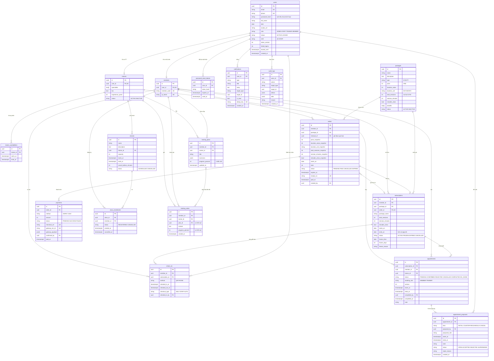

# Bản chuẩn v3: Use case – ERD – API

Bản chuẩn v3 (nhóm chốt ngày 05/10) có **44 use case, 18 bảng, 74 API** (bản v2: 28 bảng, 90 API). Mọi use case trong phạm vi đều có ít nhất một API và một bảng, mọi API phục vụ ít nhất một use case, nên độ phủ đạt 100% theo ma trận ở mục 2. Phần "ngoài phạm vi" (nâng cấp gói, giảm giá, điểm thưởng, hoàn tiền, SMS, hóa đơn điện tử, MoMo) được xóa khỏi use case thay vì để treo.

## 1. Nguyên tắc rút gọn

Giữ nguyên 4 điểm "ăn điểm" của thiết kế cũ, cắt phần hạ tầng mà đồ án nhỏ không cần.

- **Giữ:** tách gói (số buổi, thời hạn) khỏi lịch (giờ tập thật); thương lượng lịch có lịch sử đề xuất; chỉ sinh gói khi đã thanh toán; chống trùng lịch và vượt sức chứa.
- **Một use case = một chức năng**, dù nhiều actor cùng dùng. Ví dụ "xem lịch sử ra vào" của hội viên và của Staff là một use case. Mã story gốc vẫn ghi kèm để truy vết.
- **Thông tin 1–1 hoặc tối đa một lần thì là cột, không phải bảng:** biên lai (1 đơn 1 biên lai), bảo lưu (1 lần/gói), ca trực Staff, tiến độ tập (ghi trong ghi chú).
- **Mọi thay đổi lịch là một "đề xuất"**: đề xuất đầu, đề xuất lại, xin đổi lịch đã chốt, xin hủy. Một bảng, một bộ API đồng ý/từ chối.
- **Chống xử lý lặp bằng ràng buộc unique** có sẵn, không dùng bảng idempotency. Thu hồi phiên bằng `token_version` trên users, không dùng bảng phiên.
- **API đọc trả đủ cho một màn hình** (chi tiết lịch kèm lịch sử đề xuất; chi tiết đơn kèm biên lai), thay vì tách endpoint phụ.
- **Nếu giảng viên yêu cầu chuẩn hóa 3NF chặt**, có thể tách lại `benefits` và bảo lưu thành bảng riêng (+2 bảng), API không đổi.

## 2. Use case v3 và ma trận truy vết

44 use case phủ toàn bộ story trong phạm vi của Tài liệu 2 (cả bản cũ và bản mới) cùng các chức năng ERD/API đã có mà Tài liệu 2 thiếu (bảo lưu, đăng ký lớp, check-in bằng SĐT). Bảng này dùng thẳng làm chương phân tích trong báo cáo và làm khung test case. HV = hội viên; "cũ" = story trong bản User Story đầu tiên.

| Mã   | Use case                                                                           | Actor                 | Story gốc                        | API                                                                                              | Bảng                                         |
| ---- | ---------------------------------------------------------------------------------- | --------------------- | -------------------------------- | ------------------------------------------------------------------------------------------------ | -------------------------------------------- |
| UC01 | Đăng ký tài khoản                                                                  | Khách                 | M01                              | POST /auth/register                                                                              | users, members                               |
| UC02 | Đăng nhập, giữ phiên                                                               | Tất cả                | M02, T01                         | POST /auth/login, /auth/refresh                                                                  | users                                        |
| UC03 | Đăng xuất                                                                          | Tất cả                | M03                              | POST /auth/logout                                                                                | users                                        |
| UC04 | Quên mật khẩu; kích hoạt tài khoản tạo tại quầy                                    | Khách, HV             | M04                              | POST /auth/forgot-password, /auth/reset-password                                                 | password_reset_tokens, users                 |
| UC05 | Xem, sửa hồ sơ cá nhân                                                             | Tất cả                | M05, M06                         | GET /me, PATCH /me, POST /uploads/avatar                                                         | users, members, trainers                     |
| UC06 | Đổi mật khẩu                                                                       | Tất cả                | M07                              | POST /auth/change-password                                                                       | users                                        |
| UC07 | Xem, tìm, lọc, so sánh gói                                                         | Khách, HV             | M08–M11                          | GET /packages, /packages/{id}                                                                    | packages                                     |
| UC08 | Quản lý gói: thêm, sửa giá/thời hạn/số buổi/quyền lợi, ngừng bán                   | Admin                 | A06–A10                          | POST /packages, PATCH /packages/{id}                                                             | packages, audit_logs                         |
| UC09 | Mua gói hoặc gia hạn (tự mua hoặc Staff mua hộ)                                    | Khách, HV, Staff      | M12, M16 cũ, S06                 | POST /orders/quote, /orders, /orders/{id}/cancel                                                 | orders                                       |
| UC10 | Xem gói của tôi: hạn, số buổi tổng/đã tập/còn lại, phân bổ theo tháng, lịch sử gói | HV, Staff             | M14–M18, M30, M38, S05           | GET /subscriptions, /subscriptions/{id}                                                          | subscriptions, appointments                  |
| UC11 | Bảo lưu và mở lại gói                                                              | Staff, Admin          | Bổ sung (S14–S15 trong ERD)      | POST /subscriptions/{id}/freeze, /unfreeze                                                       | subscriptions, audit_logs                    |
| UC12 | Thanh toán online VNPay, nhận xác nhận                                             | HV, VNPay             | M13, M19, M20                    | POST /orders/{id}/payments, GET /payments/vnpay/ipn                                              | payments, orders, subscriptions              |
| UC13 | Thanh toán tiền mặt, xác nhận tại quầy                                             | Staff, Admin          | M19, A24                         | POST /orders/{id}/payments, /payments/{id}/confirm-cash                                          | payments, orders, audit_logs                 |
| UC14 | Xem lịch sử đơn, giao dịch, biên lai nội bộ                                        | HV, Staff, Admin      | M21, M22, A22, A23               | GET /orders, /orders/{id}, /payments, /payments/{id}                                             | orders, payments                             |
| UC15 | Hiện mã QR cá nhân                                                                 | HV                    | M24                              | GET /me                                                                                          | members                                      |
| UC16 | Check-in bằng QR hoặc SĐT, kiểm tra gói, cảnh báo sắp/đã hết hạn                   | Staff                 | M24, M27, S07, S08               | POST /check-ins                                                                                  | check_ins, subscriptions                     |
| UC17 | Check-out (tự, Staff làm hộ, tự đóng cuối ngày)                                    | HV, Staff, Hệ thống   | M25                              | POST /check-ins/{id}/checkout                                                                    | check_ins                                    |
| UC18 | Xem lịch sử ra vào, người đang tập                                                 | HV, Staff             | M26, S09                         | GET /check-ins                                                                                   | check_ins                                    |
| UC19 | Xem, tìm hội viên theo tên/SĐT/mã                                                  | Staff, Admin          | S01, S02                         | GET /members, /members/{id}                                                                      | members, users, subscriptions                |
| UC20 | Thêm, sửa hội viên tại quầy                                                        | Staff                 | S03, S04                         | POST /members, PATCH /members/{id}                                                               | users, members                               |
| UC21 | Xem danh sách và hồ sơ PT                                                          | Khách, HV             | M28, M29                         | GET /trainers, /trainers/{id}                                                                    | trainers, users                              |
| UC22 | Thiết lập khung giờ nhận lịch, tránh trùng                                         | PT, Admin             | T03, A16                         | GET, PUT /trainers/{id}/availability                                                             | trainer_availabilities                       |
| UC23 | Đề xuất lịch tập PT                                                                | HV (Staff đề xuất hộ) | M31                              | POST /appointments                                                                               | appointments, appointment_proposals          |
| UC24 | Phản hồi đề xuất: đồng ý, từ chối, đề xuất giờ khác                                | HV, PT                | M32–M34, T04–T06                 | POST /appointments/{id}/proposals, /accept, /reject                                              | appointment_proposals, appointments          |
| UC25 | Xin đổi hoặc hủy lịch đã chốt (bên kia phải đồng ý)                                | HV, PT                | M36, T08                         | POST /appointments/{id}/proposals (RESCHEDULE, CANCEL), /accept, /reject                         | appointment_proposals, appointments          |
| UC26 | Xem lịch ngày/tuần/tháng, yêu cầu đang chờ, buổi đã tập                            | HV, PT, Staff         | M35, M37, T02, T07               | GET /appointments, /appointments/{id}, GET /classes?trainerId                                    | appointments, appointment_proposals, classes |
| UC27 | Xác nhận buổi hoàn thành hoặc vắng (trừ 1 buổi)                                    | PT, Admin             | T09                              | POST /appointments/{id}/complete                                                                 | appointments                                 |
| UC28 | Xem hội viên mình phụ trách và số buổi còn lại                                     | PT                    | T06–T07 cũ, T10                  | GET /trainers/{id}/members, /members/{id}                                                        | appointments, subscriptions, members         |
| UC29 | Ghi chú tình trạng, cập nhật tiến độ tập                                           | PT (HV xem)           | T08, T10 cũ                      | GET, POST /members/{id}/training-notes                                                           | training_notes, training_plans               |
| UC30 | Lập và sửa kế hoạch tập                                                            | PT (HV xem)           | T09 cũ                           | GET, POST /members/{id}/training-plans, PATCH /training-plans/{id}                               | training_plans                               |
| UC31 | Xem danh sách tài khoản                                                            | Admin                 | A01                              | GET /users, /users/{id}                                                                          | users                                        |
| UC32 | Tạo tài khoản Staff, PT                                                            | Admin                 | A02, A11, A14                    | POST /users                                                                                      | users, trainers                              |
| UC33 | Sửa tài khoản, thông tin nhân viên, chuyên môn PT                                  | Admin                 | A03, A12, A15                    | PATCH /users/{id}, PATCH /trainers/{id}                                                          | users, trainers                              |
| UC34 | Khóa/mở khóa, ngừng hoạt động tài khoản                                            | Admin                 | A04, A13                         | PATCH /users/{id}/status                                                                         | users, audit_logs                            |
| UC35 | Phân quyền (đổi vai trò)                                                           | Admin                 | A05                              | PATCH /users/{id}/role                                                                           | users, trainers, audit_logs                  |
| UC36 | Quản lý lớp: tạo, sửa, hủy, gán PT, sức chứa                                       | Admin                 | A17–A21                          | POST /classes, PATCH /classes/{id}                                                               | classes                                      |
| UC37 | Xem lớp, đăng ký, hủy đăng ký                                                      | HV                    | Sơ đồ Member (M39–M43 trong ERD) | GET /classes, /classes/{id}, POST /classes/{id}/enrollments, DELETE /classes/{id}/enrollments/me | classes, class_enrollments                   |
| UC38 | Xem danh sách đăng ký của lớp                                                      | Admin, Staff, PT      | A21                              | GET /classes/{id}/enrollments                                                                    | class_enrollments                            |
| UC39 | Báo cáo doanh thu theo ngày/tháng/năm và theo gói                                  | Admin                 | A25, A26                         | GET /reports/revenue                                                                             | payments, orders                             |
| UC40 | Thống kê: tổng hội viên, hội viên mới, sắp hết hạn, lượt check-in, gói phổ biến    | Admin                 | A28–A32                          | GET /reports/overview, /reports/expiring-subscriptions                                           | members, subscriptions, check_ins, orders    |
| UC41 | Xuất báo cáo Excel                                                                 | Admin                 | A27                              | GET /reports/export                                                                              | (như UC39–UC40)                              |
| UC42 | Nhận, xem, đánh dấu đã đọc thông báo                                               | Tất cả                | N01, N03–N05, M20, M23           | GET /notifications, PATCH /notifications/{id}/read                                               | notifications                                |
| UC43 | Gửi thông báo chủ động                                                             | Admin                 | N06                              | POST /notifications/broadcast                                                                    | notifications                                |
| UC44 | Thông báo tự động: gói sắp hết hạn, nhắc lịch, nhắc PT xác nhận                    | Hệ thống (job)        | N02, M35 cũ                      | (job nền, không có API)                                                                          | notifications                                |

Kiểm tra 100%: mọi story trong phạm vi của Tài liệu 2 xuất hiện ở cột Story gốc. Riêng M17 cũ (nâng cấp gói) và "áp dụng mã giảm giá" đã chuyển ra ngoài phạm vi. Mỗi dòng có API (UC44 là job nền) và bảng. 74 API ở mục 4 đều nằm trong cột API (trừ GET /health dùng cho vận hành).

## 3. ERD v3: 18 bảng

Tên bảng và cột viết tiếng Anh snake_case để khớp code và API; báo cáo có thể ghi kèm tên tiếng Việt ở cột cuối. Khóa chính UUID, thời điểm timestamptz, không xóa cứng (dùng status). Số buổi đã tập/còn lại, trạng thái "khách hay hội viên", PT phụ trách đều tính ra từ dữ liệu, không lưu cột.

&#91;embedded content: ERD v3 · 18 bảng, quan hệ chính\]

| Bảng                   | Cột chính                                                                                                                                                                                                                                         | Quan hệ và ràng buộc                                                                                                                             | Thay cho (v2)                                  |
| ---------------------- | ------------------------------------------------------------------------------------------------------------------------------------------------------------------------------------------------------------------------------------------------- | ------------------------------------------------------------------------------------------------------------------------------------------------ | ---------------------------------------------- |
| users                  | id, email, phone, password_hash (null = hội viên tạo tại quầy chưa kích hoạt), full_name, dob, avatar_url, role (ADMIN/STAFF/TRAINER/MEMBER), status (ACTIVE/LOCKED), shift (chỉ STAFF), token_version, failed_logins, locked_until               | email, phone unique; 1–0..1 members; 1–0..1 trainers; khóa hoặc đổi mật khẩu thì tăng token_version để thu hồi mọi phiên                         | TAI_KHOAN, NHAN_VIEN, PHIEN_DANG_NHAP, TAP_TIN |
| members                | id, user_id, member_code, qr_token                                                                                                                                                                                                                | user_id unique (1–1 với users); member_code, qr_token unique                                                                                     | HOI_VIEN                                       |
| trainers               | id, user_id, specialties text\[\], bio, experience_years, status                                                                                                                                                                                  | user_id unique (1–1 với users)                                                                                                                   | PT                                             |
| trainer_availabilities | id, trainer_id, starts_at, ends_at                                                                                                                                                                                                                | n–1 trainers; các khoảng của một PT không chồng nhau                                                                                             | KHUNG_GIO_RANH_PT                              |
| password_reset_tokens  | id, user_id, token_hash, expires_at, used_at                                                                                                                                                                                                      | n–1 users; dùng một lần, hạn 30 phút                                                                                                             | TOKEN_DAT_LAI_MAT_KHAU                         |
| packages               | id, name, description, type (GYM/PT), price, duration_value, duration_unit (DAY/MONTH), total_sessions (null với GYM), session_minutes, includes_class, benefits text\[\], status (ACTIVE/INACTIVE)                                               | 1–n orders; 1–n subscriptions                                                                                                                    | GOI_TAP, QUYEN_LOI_GOI                         |
| orders                 | id, member_id, package_id, renewal_of (subscription), các cột snapshot (price, duration, total_sessions, session_minutes, includes_class), starts_on, total, status (PENDING/PAID/CANCELLED/EXPIRED), expires_at, receipt_no, paid_at, created_by | n–1 members, packages; 1–n payments; 1–0..1 subscriptions; unique một PENDING mỗi (member, package)                                              | DON_HANG, BIEN_LAI                             |
| payments               | id, order_id, method (VNPAY/CASH), amount, status (PENDING/SUCCESS/FAILED), merchant_ref, gateway_txn_id, gateway_payload jsonb, confirmed_by, paid_at                                                                                            | n–1 orders; merchant_ref unique; gateway_txn_id unique (IPN gửi lặp không cộng tiền 2 lần); một SUCCESS mỗi đơn                                  | THANH_TOAN, GIAO_DICH_CONG_LOG                 |
| subscriptions          | id, member_id, package_id, order_id, các cột snapshot, starts_on, ends_on (tính cả ngày đó), status (ACTIVE/FROZEN/EXPIRED/CANCELLED), frozen_from, frozen_days, freeze_reason                                                                    | n–1 members, packages; order_id unique (1–1 với orders); 1–n appointments, check_ins; bảo lưu tối đa 1 lần                                       | GOI_TAP_HOI_VIEN, BAO_LUU_GOI                  |
| appointments           | id, subscription_id, member_id, trainer_id, status (PENDING/CONFIRMED/REJECTED/CANCELLED/COMPLETED/NO_SHOW), awaiting_role, version, starts_at, ends_at, completed_by, completed_at, note                                                         | n–1 subscriptions, members, trainers; 1–n appointment_proposals; exclusion constraint: lịch CONFIRMED không chồng giờ cùng PT hoặc cùng hội viên | LICH_TAP_PT                                    |
| appointment_proposals  | id, appointment_id, kind (INITIAL/COUNTER/RESCHEDULE/CANCEL), proposed_by, proposed_role, starts_at, ends_at, note, status (OPEN/ACCEPTED/REJECTED/SUPERSEDED), reject_reason                                                                     | n–1 appointments; n–1 users (người đề xuất); tối đa một OPEN mỗi lịch                                                                            | DE_XUAT_LICH, YEU_CAU_DOI_LICH                 |
| training_plans         | id, member_id, trainer_id, title, exercises jsonb, progress_percent                                                                                                                                                                               | n–1 members, trainers; 1–n training_notes                                                                                                        | KE_HOACH_TAP_LUYEN                             |
| training_notes         | id, member_id, trainer_id, plan_id (null), content, progress_percent (null)                                                                                                                                                                       | n–1 members, trainers; n–0..1 training_plans; ghi chú có % thì cập nhật tiến độ kế hoạch                                                         | GHI_CHU_TAP_LUYEN, TIEN_DO_TAP_LUYEN           |
| classes                | id, name, description, trainer_id, capacity, starts_at, ends_at, cancel_before_minutes, status (SCHEDULED/CANCELLED)                                                                                                                              | n–1 trainers; 1–n class_enrollments; không trùng giờ lịch PT của cùng PT (kiểm trong transaction)                                                | LOP_HOC                                        |
| class_enrollments      | id, class_id, member_id, status (REGISTERED/CANCELLED), cancelled_at                                                                                                                                                                              | n–1 classes, members (members n–n classes); unique (class, member) khi REGISTERED                                                                | DANG_KY_LOP_HOC                                |
| check_ins              | id, member_id, subscription_id, method (QR/PHONE), checked_in_at, checked_out_at, checkout_type (SELF/STAFF/AUTO), checked_in_by                                                                                                                  | n–1 members, subscriptions, users (Staff); một lượt chưa check-out mỗi hội viên                                                                  | LICH_SU_RA_VAO                                 |
| notifications          | id, user_id, type, title, body, target_type, target_id, is_read, dedup_key                                                                                                                                                                        | n–1 users; dedup_key unique (job không nhắc trùng)                                                                                               | THONG_BAO                                      |
| audit_logs             | id, actor_id, action, target_type, target_id, before jsonb, after jsonb, reason                                                                                                                                                                   | n–1 users; chỉ thêm, không sửa/xóa                                                                                                               | AUDIT_LOG                                      |

Bỏ hẳn: KHOA_IDEMPOTENCY (unique constraint đã chặn xử lý lặp; FE khóa nút sau lần bấm đầu).

Bản chuẩn này đủ để bắt đầu code: đủ bảng, cột, kiểu, quan hệ, ràng buộc; đủ endpoint, quyền, use case. Còn 2 việc chuyển thành tài liệu kỹ thuật trong tuần 1: Hồng Anh viết schema.prisma từ code ERD dưới đây (09/10); Triển viết openapi.yaml với request/response từng endpoint (08/10 cho nhóm demo, 16/10 đủ 74 API).

Code Mermaid vẽ ERD đầy đủ (dán vào mermaid.live hoặc draw.io để xuất ảnh cho báo cáo):

## 4. API v3: 74 endpoint

Giữ nguyên quy ước của v2: base `/api/v1`, JSON camelCase, phân trang `{data, meta}`, lỗi `{error:{code, message, details}}`, tiền là số nguyên VND, giờ ISO 8601 +07:00. "Của mình" nghĩa là BE kiểm tra quyền sở hữu trên mọi {id}.

| Nhóm             | Endpoint                                                                                                                                                                                          | Quyền                                                 | Use case         |
| ---------------- | ------------------------------------------------------------------------------------------------------------------------------------------------------------------------------------------------- | ----------------------------------------------------- | ---------------- |
| Xác thực (7)     | POST /auth/register · /auth/login · /auth/refresh · /auth/forgot-password · /auth/reset-password                                                                                                  | Public                                                | UC01, UC02, UC04 |
|                  | POST /auth/logout · /auth/change-password                                                                                                                                                         | Đã đăng nhập                                          | UC03, UC06       |
| Hồ sơ (3)        | GET /me (kèm hồ sơ theo vai trò, qrToken với MEMBER) · PATCH /me · POST /uploads/avatar                                                                                                           | Đã đăng nhập                                          | UC05, UC15       |
| Gói (4)          | GET /packages (lọc q, type, minPrice, maxPrice, thời hạn) · GET /packages/{id}                                                                                                                    | Public                                                | UC07             |
|                  | POST /packages · PATCH /packages/{id} (gồm ngừng bán)                                                                                                                                             | Admin                                                 | UC08             |
| Đơn hàng (5)     | POST /orders/quote · POST /orders · GET /orders · GET /orders/{id} (kèm biên lai khi PAID) · POST /orders/{id}/cancel                                                                             | Member (của mình), Staff, Admin                       | UC09, UC14       |
| Thanh toán (5)   | POST /orders/{id}/payments (method VNPAY hoặc CASH) · GET /payments (lọc from, to, method, memberId) · GET /payments/{id}                                                                         | Member (của mình), Staff, Admin                       | UC12, UC13, UC14 |
|                  | POST /payments/{id}/confirm-cash                                                                                                                                                                  | Staff, Admin                                          | UC13             |
|                  | GET /payments/vnpay/ipn                                                                                                                                                                           | VNPay (kiểm chữ ký)                                   | UC12             |
| Gói hội viên (4) | GET /subscriptions · GET /subscriptions/{id} (kèm số buổi theo tháng, lịch sử bảo lưu)                                                                                                            | Member (của mình), Staff, Admin                       | UC10             |
|                  | POST /subscriptions/{id}/freeze · /unfreeze                                                                                                                                                       | Staff, Admin                                          | UC11             |
| Check-in (3)     | POST /check-ins (QR hoặc SĐT)                                                                                                                                                                     | Staff, Admin                                          | UC16             |
|                  | POST /check-ins/{id}/checkout (checkoutType theo người gọi)                                                                                                                                       | Member (của mình), Staff, Admin                       | UC17             |
|                  | GET /check-ins (lọc memberId, from, to, present=true)                                                                                                                                             | Member (của mình), Staff, Admin                       | UC18             |
| Hội viên (4)     | GET /members · GET /members/{id} · POST /members · PATCH /members/{id}                                                                                                                            | Staff, Admin; PT xem chi tiết hội viên mình phụ trách | UC19, UC20, UC28 |
| PT (6)           | GET /trainers · GET /trainers/{id} · GET /trainers/{id}/availability                                                                                                                              | Public                                                | UC21, UC22       |
|                  | PUT /trainers/{id}/availability                                                                                                                                                                   | PT (của mình), Admin                                  | UC22             |
|                  | PATCH /trainers/{id}                                                                                                                                                                              | Admin                                                 | UC33             |
|                  | GET /trainers/{id}/members                                                                                                                                                                        | PT (của mình), Admin                                  | UC28             |
| Lịch PT (7)      | POST /appointments · GET /appointments (lọc from, to, status, memberId, trainerId) · GET /appointments/{id} (kèm lịch sử đề xuất, allowedActions)                                                 | Member, PT, Staff, Admin (theo quyền sở hữu)          | UC23, UC26       |
|                  | POST /appointments/{id}/proposals (kind COUNTER, RESCHEDULE, CANCEL; kèm expectedVersion) · POST …/accept · POST …/reject                                                                         | Bên tham gia đang được hỏi                            | UC24, UC25       |
|                  | POST /appointments/{id}/complete (result COMPLETED hoặc NO_SHOW)                                                                                                                                  | PT phụ trách, Admin                                   | UC27             |
| Theo dõi tập (5) | GET, POST /members/{id}/training-notes · GET, POST /members/{id}/training-plans · PATCH /training-plans/{id}                                                                                      | PT phụ trách ghi; Member xem của mình; Admin          | UC29, UC30       |
| Tài khoản (6)    | GET /users · GET /users/{id} · POST /users (tạo kèm hồ sơ PT) · PATCH /users/{id} · PATCH /users/{id}/status · PATCH /users/{id}/role                                                             | Admin                                                 | UC31–UC35        |
| Lớp học (7)      | GET /classes (lọc trainerId, from, to) · GET /classes/{id}                                                                                                                                        | Public                                                | UC26, UC37       |
|                  | POST /classes · PATCH /classes/{id} (gồm hủy lớp)                                                                                                                                                 | Admin                                                 | UC36             |
|                  | POST /classes/{id}/enrollments · DELETE /classes/{id}/enrollments/me                                                                                                                              | Member                                                | UC37             |
|                  | GET /classes/{id}/enrollments                                                                                                                                                                     | Admin, Staff, PT của lớp                              | UC38             |
| Báo cáo (4)      | GET /reports/overview (hội viên mới, lượt check-in, gói phổ biến theo from, to, groupBy) · GET /reports/revenue (theo kỳ và theo gói) · GET /reports/expiring-subscriptions · GET /reports/export | Admin                                                 | UC39–UC41        |
| Thông báo (3)    | GET /notifications (meta.unreadCount) · PATCH /notifications/{id}/read                                                                                                                            | Đã đăng nhập, của mình                                | UC42             |
|                  | POST /notifications/broadcast                                                                                                                                                                     | Admin                                                 | UC43             |
| Vận hành (1)     | GET /health                                                                                                                                                                                       | Public                                                | —                |

## 5. Thay đổi so với v2 và ảnh hưởng đến phân công

Giảm 10 bảng và 16 API, không mất chức năng nào trong phạm vi.

| v2                                                                                | v3                                                              | Vì sao được                                                                            |
| --------------------------------------------------------------------------------- | --------------------------------------------------------------- | -------------------------------------------------------------------------------------- |
| YEU_CAU_DOI_LICH + 3 API change-requests                                          | Một đề xuất có kind RESCHEDULE/CANCEL, dùng chung accept/reject | Cùng cơ chế "một bên đề xuất, bên kia đồng ý"; lịch cũ giữ nguyên khi đề xuất còn OPEN |
| PHIEN_DANG_NHAP                                                                   | users.token_version                                             | Khóa tài khoản, đổi/đặt lại mật khẩu thì tăng số này; mọi token cũ hết hiệu lực        |
| NHAN_VIEN                                                                         | users.shift                                                     | Staff không có dữ liệu riêng nào khác                                                  |
| TAP_TIN                                                                           | users.avatar_url                                                | Upload trả URL nằm trong thư mục của server; BE chỉ nhận URL do mình cấp               |
| QUYEN_LOI_GOI                                                                     | packages.benefits text\[\]                                      | Chỉ là danh sách chữ hiển thị                                                          |
| BAO_LUU_GOI                                                                       | 3 cột trên subscriptions                                        | Tối đa 1 lần/gói (đã chốt ở mục 10 tab chính)                                          |
| BIEN_LAI + GET /receipt                                                           | orders.receipt_no, biên lai nằm trong GET /orders/{id}          | 1 đơn đã trả = 1 biên lai                                                              |
| GIAO_DICH_CONG_LOG                                                                | payments.gateway_payload + unique gateway_txn_id                | Chỉ dùng VNPay; unique đủ chặn cộng tiền hai lần                                       |
| TIEN_DO_TAP_LUYEN + 2 API progress                                                | training_notes.progress_percent                                 | Mỗi lần cập nhật tiến độ là một ghi chú có %                                           |
| KHOA_IDEMPOTENCY                                                                  | Bỏ                                                              | Unique constraint + khóa nút ở FE                                                      |
| /usage, /receipt, /proposals (GET), /present, /force-checkout, /qr, /unread-count | Gộp vào API đọc hoặc tham số lọc                                | API đọc trả đủ cho một màn hình                                                        |
| /reports/packages, /members, /check-ins                                           | Gộp vào /reports/overview                                       | Một dashboard gọi một API                                                              |
| /class-enrollments                                                                | /classes/{id}/enrollments                                       | Đường dẫn rõ thuộc lớp nào; thêm quyền PT, Staff                                       |
| Lịch PT không có vắng mặt                                                         | Thêm NO_SHOW                                                    | Đã chốt ở mục 10 tab chính                                                             |

Các thay đổi này đã được cập nhật vào tab Phân công chi tiết:

- **Hồng Anh:** tuần 1–2 migration 18 bảng thay vì 27; tuần 3 bỏ API /qr (QR nằm trong /me); tuần 6 bỏ bảng tiến độ và 2 API progress, bảo lưu chỉ cập nhật cột. Phần thời gian dư dùng viết test tích hợp.
- **Triển:** tuần 2 dùng token_version thay bảng phiên; tuần 4 VNPay không cần bảng log; tuần 6 "đổi/hủy lịch" là thêm kind cho proposals có sẵn, tiết kiệm khoảng 2 ngày; tuần 8 chỉ còn 4 API báo cáo.
- **Sơn, Bằng:** đổi đường dẫn gọi API theo mục 4; màn đổi/hủy lịch dùng lại component đề xuất.
- **Huy Trường:** dùng bảng mục 2 làm Tài liệu 2 v3 và đặt tên test case theo mã UC (TC-UC24-03…).
