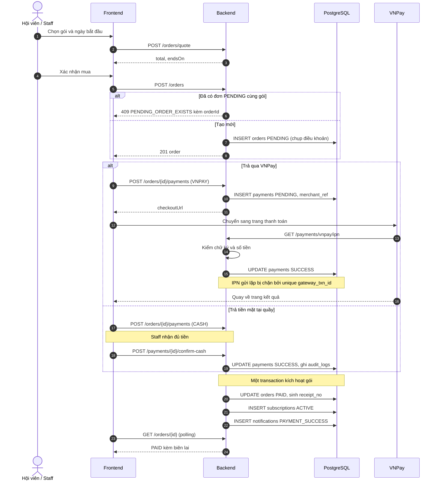
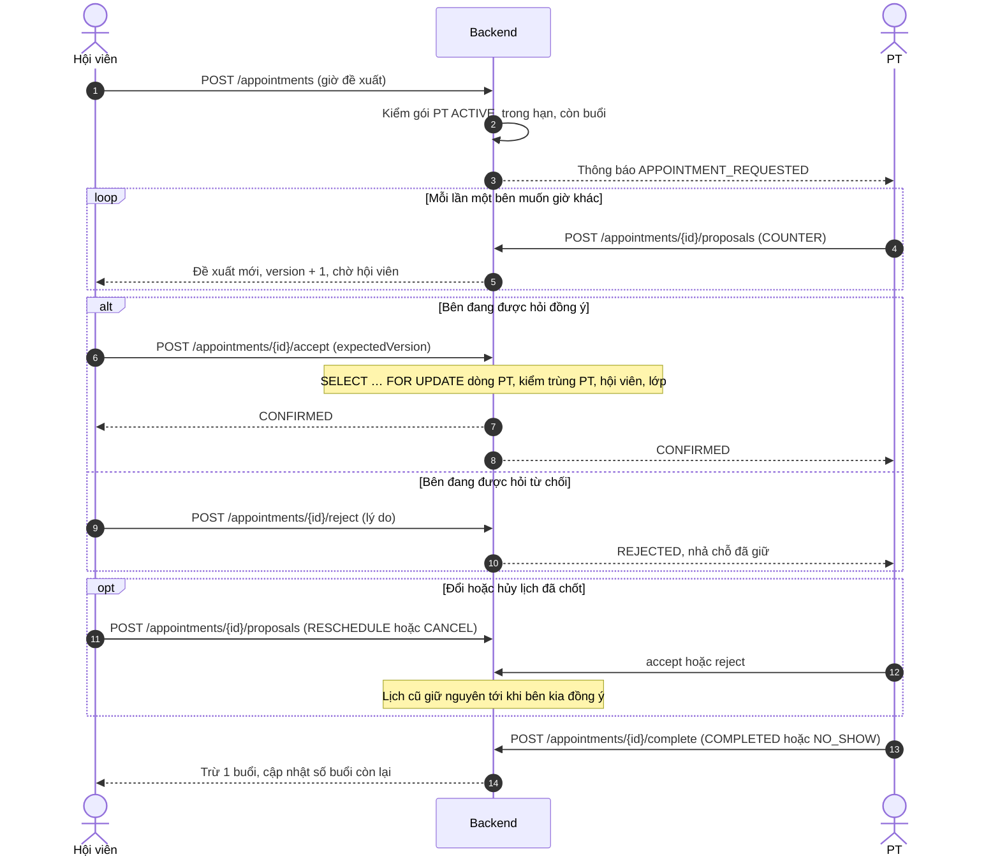
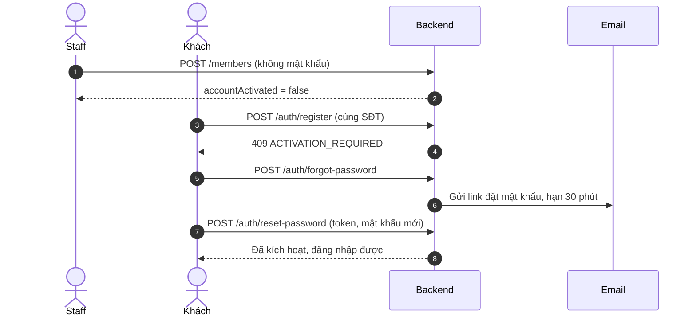

# Sơ đồ tuần tự các luồng khó

- **Ai sở hữu:** Triển (thanh toán, lịch PT), Hồng Anh (kích hoạt tài khoản). **Khi nào cập nhật:** khi luồng hoặc API đổi.
- Bảng từng bước của các luồng nằm ở mục 12 tài liệu Tiến hành công việc.

## Mua gói và thanh toán (UC09, UC12, UC13)

## Thương lượng lịch PT (UC23–UC27)

## Kích hoạt tài khoản tạo tại quầy (UC20, UC01, UC04)

