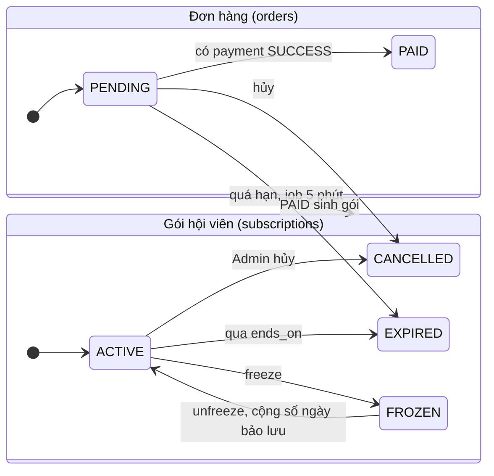
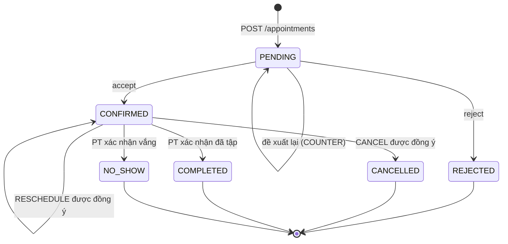
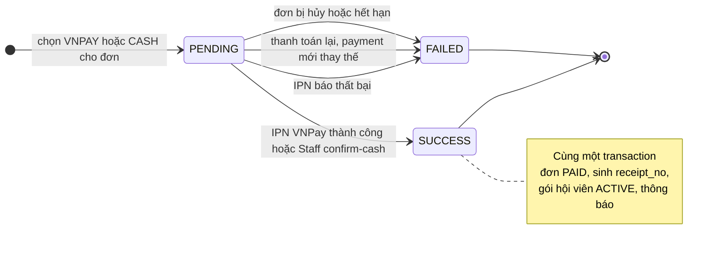
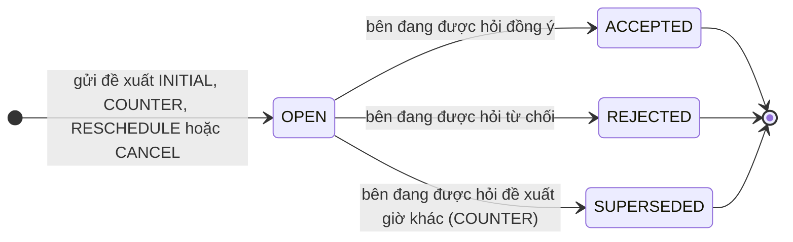
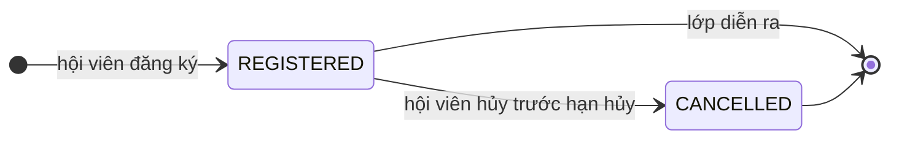
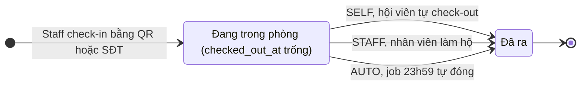

# Sơ đồ trạng thái

- **Ai sở hữu:** Triển. **Khi nào cập nhật:** khi đổi trạng thái hay chuyển trạng thái trong ERD hoặc API.
- Đủ 7 sơ đồ: Đơn hàng, Gói hội viên, Lịch PT, Thanh toán, Đề xuất lịch PT, Đăng ký lớp, Lượt check-in.
- Dán code vào mermaid.live hoặc draw.io để xuất ảnh cho báo cáo.

## Đơn hàng và gói hội viên

## Lịch PT (appointments)

## Thanh toán (payments)

- Mỗi đơn tối đa 1 payment PENDING và 1 payment SUCCESS (ERD v3).
- IPN gửi lặp không đổi trạng thái lần hai (unique `gateway_txn_id`).
- Giả định của Triển (openapi v0.1): đơn hết hạn thì payment PENDING chuyển FAILED, giống khi hủy đơn.
- Chưa chốt (Q17): IPN báo thành công cho payment đã FAILED vì bị thay thế.

## Đề xuất lịch PT (appointment_proposals)

- Mỗi lịch tối đa 1 đề xuất OPEN. Chỉ bên đang được hỏi (`awaiting_role`) mới được đồng ý, từ chối hoặc COUNTER.
- Mọi hành động gửi `expectedVersion`; thành công thì `appointments.version + 1`, lệch thì `STALE_VERSION`.
- Đề xuất ảnh hưởng lịch PT như sau:

| Loại đề xuất | Được đồng ý | Bị từ chối |
| --- | --- | --- |
| INITIAL, COUNTER (lịch PENDING) | Lịch → CONFIRMED | Lịch → REJECTED, nhả buổi đang giữ |
| RESCHEDULE (lịch CONFIRMED) | Lịch giữ CONFIRMED, đổi sang giờ mới | Lịch giữ nguyên giờ cũ |
| CANCEL (lịch CONFIRMED) | Lịch → CANCELLED, không trừ buổi | Lịch giữ nguyên |

## Đăng ký lớp (class_enrollments)

- Đăng ký cần gói ACTIVE có `includes_class` (`NO_CLASS_BENEFIT`) và lớp còn chỗ (`CLASS_FULL`).
- Hạn hủy: trước giờ bắt đầu `cancel_before_minutes` phút, mặc định 120 (quyết định 11); quá hạn thì `CANCELLATION_WINDOW_PASSED`.
- Hủy rồi đăng ký lại thì tạo dòng mới (unique `(class_id, member_id)` chỉ áp khi REGISTERED).
- Chưa chốt: Admin hủy lớp thì các đăng ký REGISTERED xử lý thế nào. Chốt khi viết openapi nhóm Lớp học (16/10).

## Lượt check-in (check_ins)

Bảng không có cột trạng thái; trạng thái suy ra từ `checked_out_at`.

- Mỗi hội viên chỉ có 1 lượt đang trong phòng; check-in tiếp khi chưa ra thì `ALREADY_CHECKED_IN`.
- Check-in không trừ buổi PT.
