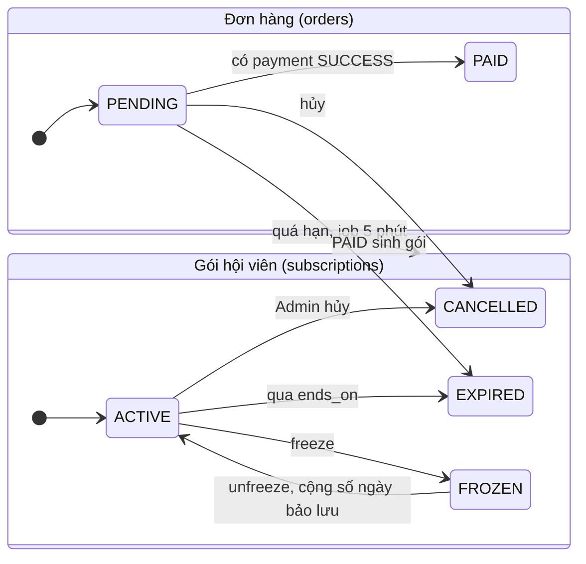
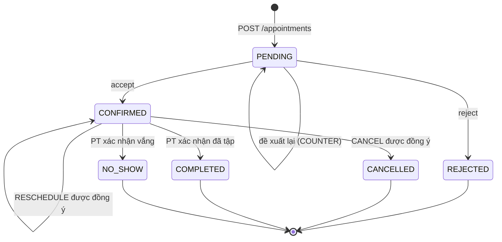

# Sơ đồ trạng thái

- **Ai sở hữu:** Triển. **Khi nào cập nhật:** khi đổi trạng thái hay chuyển trạng thái trong ERD hoặc API.
- Đã có: Đơn hàng, Gói hội viên, Lịch PT. Triển bổ sung Thanh toán, Đề xuất lịch, Đăng ký lớp, Lượt check-in trước 09/10.
- Dán code vào mermaid.live hoặc draw.io để xuất ảnh cho báo cáo.

## Đơn hàng và gói hội viên

## Lịch PT (appointments)

## Còn thiếu (Triển)
- Thanh toán: PENDING → SUCCESS / FAILED.
- Đề xuất lịch: OPEN → ACCEPTED / REJECTED / SUPERSEDED.
- Đăng ký lớp: REGISTERED → CANCELLED.
- Lượt check-in: đang trong phòng → đã ra (SELF, STAFF, AUTO).
