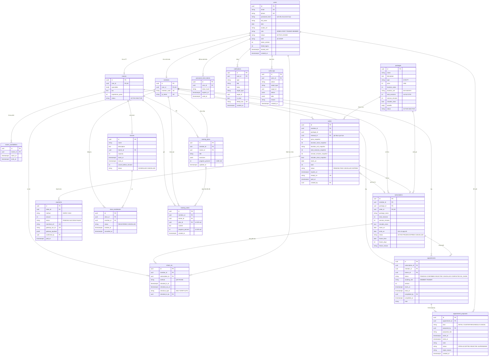

# ERD v3 (đã chốt 05/10/2026) — 18 bảng

PostgreSQL 15+, khóa chính UUID, thời điểm `timestamptz`, không xóa cứng (dùng `status`).
Các con số tính ra được thì không lưu cột: số buổi đã tập/còn lại, khách hay hội viên, PT phụ trách.

## Ràng buộc quan trọng (Prisma không tự sinh, phải viết SQL tay trong migration)

- `orders`: unique một đơn PENDING mỗi (member_id, package_id) — partial unique index.
- `payments`: `merchant_ref` unique; `gateway_txn_id` unique khi khác null; một SUCCESS mỗi đơn; một PENDING mỗi đơn.
- `subscriptions`: `order_id` unique (quan hệ 1–1 với orders).
- `appointments`: exclusion constraint (btree_gist) để lịch CONFIRMED không chồng giờ cùng `trainer_id`, và cùng `member_id`.
- `appointment_proposals`: tối đa một OPEN mỗi `appointment_id`.
- `check_ins`: một lượt `checked_out_at IS NULL` mỗi `member_id`.
- `class_enrollments`: unique (class_id, member_id) khi REGISTERED.
- `trainer_availabilities`: khoảng thời gian của cùng một PT không chồng nhau.
- `notifications.dedup_key` unique; `audit_logs` chỉ INSERT.
- Tìm tên không dấu: extension `unaccent` + `pg_trgm` trên `users.full_name`.
- Kiểm tra trùng lịch giữa lớp học và lịch PT trong transaction có `SELECT … FROM trainers WHERE id = $1 FOR UPDATE`.

## Sơ đồ

